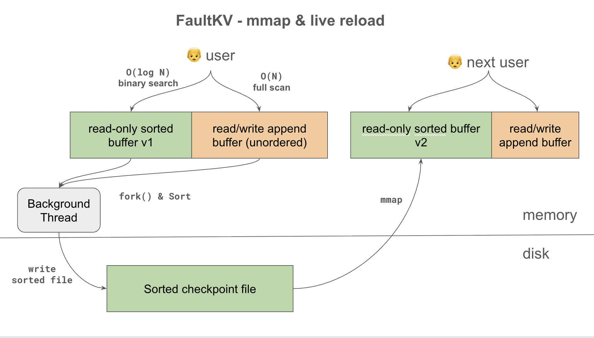
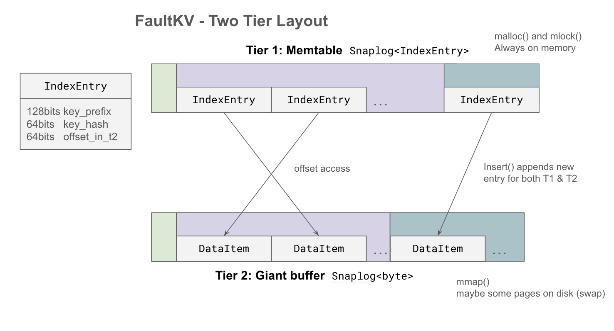

# VMemKV: OS-Driven Larger-than-Memory KVS

## 1. 概要

**VMemKV** は、データ管理を **OS の仮想メモリシステムおよびfile-backed memory map (mmap) 機構** になるべく移譲するよう設計されたKVSである。
`fork()` ベースのスナップショット、`mincore()` によるホット/コールドデータ検出、`mmap()` によるオンデマンドページロードなどを組み合わせることで、VMemKV は極めてシンプルなコードベースで堅牢なLarger-than-memory KVS を実現する。バッファプール、LRUによるページ置換アルゴリズム、Pointer swizzling、複雑なコンパクションといった従来コンポーネントを OS ネイティブのプリミティブに置き換え，シンプルなコードベースで実現する。

VMemKVの非常に抽象化されたイメージは以下


- メモリ上のバッファを Read-only region と Read/write region に分割する
- 定期的に `fork()` し，バックグラウンドスレッドが全領域をソートする
- ソートしたバッファを丸ごとディスクに書き出し，チェックポイントファイルとする
- チェックポイントファイルを `mmap()` して新しいread-only regionとして切り替える

## 2. Features & Limitations

### What VMemKV can do:

- **Larger-than-memory:** メモリ量を超えるデータを扱える．
- **KVSインタフェース** Get / Update / Insert / Delete / ScanいわゆるCRUDL操作をサポートする．
- **永続性:** WAL およびチェックポイントによりデータ整合性を保証する．
- **シンプルなコードベース:** OS の仮想メモリ管理を活用することで、従来のKVSに必要な複雑なバッファ管理やページ置換ロジックを排除する．

### What VMemKV cannot do:

- **トランザクション:** 単一の Put/Delete 操作は原子であるが、複数操作のアトミックなグループ化はサポートしない。
- **ファントム回避:** Get/Scan は、存在するキーを見逃す可能性がある。完全なファントム回避には、Precision Locking などの外部メカニズムが必要である。

## 3. SnapLog\<T\>

VMemKVの設計を説明する前に，設計の中心となる重要なデータ構造 **SnapLog** を導入する．

**SnapLog\<T\>** は，読み取り専用の Read only stable regionと，追記専用の Append-only region を組み合わせた抽象データ構造である．
SnapLogは以下のコンポーネントで構成される．

- Read only stable region（`ro_region`）: ソートされたエントリの配列。O(log N)でのアクセスを提供する．
- Append-only region（`ap_region`）: ソートされていないエントリの配列。単純な追記バッファで、InsertはO(1)，それ以外はO(N)でアクセスできる。

SnapLogは以下のように利用される．

- Get: `ro_region` を二分探索し、見つからなければ `ap_region` を線形スキャンする。
- Insert: `ap_region` の末尾に新しいエントリを追記する。
- Delete: `ro_region` と `ap_region` の両方をスキャンして、削除対象のエントリを特定し、削除フラグを立てる。
- Update: 既存エントリを `ro_region` または `ap_region` で特定し、in-placeで更新する。サイズが割り当てられた領域を超える場合は `Delete` と `Insert` の組み合わせで実行する．
- Scan: `ro_region` と `ap_region` の両方をスキャンする．


SnapLog は定期的にバックグラウンドのスレッドが `ap_region` を `ro_region` にマージすることで、ソート済みの `ro_region` の割合を保ち、`ap_region` のサイズを制限する。
これを **Background Merge** と呼ぶ。これにより，順序断片化を制御し，Get と Scan の性能が維持される。
マージは、単純に二つの配列をマージソートした新たな配列を生成し、アトミック命令で `ro_region` と `ap_region` を更新することで行われる。
マージ中に到着した新しいエントリは、マージ前の `ap_region` に追記され続けるため、書き込みは失われない。


## 4. High Level Design

VMemKVは 2つのSnapLogインスタンスを二層構成で使用するKVSである．
それぞれ **Tier 1 (memtable)** と **Tier 2 (Giant Buffer)** と呼ばれる。Tier 1 は固定長のインデックスエントリを保持する `SnapLog<IndexEntry>`であり、Tier 2 は生のキーバリューデータを保持するストレージ `SnapLog<ValueEntry>`である。
Tier 1 はすべてメモリ上に存在し， `mlock()` によってスワップアウトを拒否する．VMemKVのすべてのキーが保持される．具体的には，Tier 1 に8GBのメモリを割り当てるとき，約2億エントリを保持できる（32バイト）．
Tier 2 はより大きなサイズで設計され、メモリ量を超えることが想定され，OSのファイルバック `mmap` を利用する．


IndexEntry は 各キーのprefixとhash値，そしてTier 2 におけるオフセットを持つ．
ValueEntry は 実際のキーと値のペアを保持する可変長構造体である．

### 基本操作

VMemKVは以下のような手続きでKeyからValueにアクセスする．

以下は `Get(key)` の例である．

1. Key を Tier 1 の SnapLog を用いて検索する．
2. 見つかった IndexEntry の hash と hash(key) を比較する．不一致ならば，prefix が衝突しているだけなので，1に戻る．
3. hash が一致した場合，IndexEntry の offset を用いて Tier 2 のSnapLogのValueEntryにアクセスする．．
4. Tier 2 から取得したフルキーと検索キーを比較する．一致すればValueEntryを返す．不一致ならば，ハッシュ衝突なので1に戻る．

`Insert(key, value)` は以下のように動作する．

1. Tier 2 の末尾に `ValueEntry(key, value)` を追記する．このときの論理オフセットを記録する．
2. Tier 1 に `IndexEntry(key_prefix, hash(key), offset)` を追記する．

### Checkpoint & Live Reload

VMemKVは，定期的にチェックポイントを実行する．このチェックポイントが，永続性を保証し，かつVMemKVの順序断片化と空間断片化を制御する．
具体的には，`fork()` を用いて子プロセスを生成し、断片化を解消した新たなチェックポイントファイルを生成し，永続化する．親プロセスにはそのファイルを `mmap()` して新しいSnapLogインスタンスとして切り替えさせる．
この一連の流れを **Live Reload** と呼ぶ．

断片化を解消することは，Tier 1 については SnapLog の章で説明したものと全く同一のロジックで実行できる．
Tier 2 については，key が Tier 1 にしか存在しないことから，キーを使ってソートする処理がTier 2 単独では実行できないため，Tier 1 の助けを借りてマージ処理を行う．具体的には，以下の手続きを取る．


1. Tier 1 の Background Merge を行う．
2. `fork()` を行い別のプロセスに移動する．
3. チェックポイントファイルを作成する．
4. Tier 1 のソート済みのキーをフルスキャンしながら，キーの順序で Tier 2 の `ValueEntry` をチェックポイントファイルにコピーする．このとき，削除されたキー（tombstone）をスキップする．
   - このとき， `mincore()` と `madvise(MADV_DONTNEED)` を用いて、元々コールドだったページを特定し、書き込み後に `madvise(MADV_DONTNEED)` を呼び出すことで、コールドデータで RAM を汚染しないようにする．
   - このとき，Tier 1 のオフセットを Tier 2 の新しいオフセットに置き換える．
5. Tier 1 と Tier 2 のチェックポイントファイルを永続化する．
6. 親プロセスがチェックポイントファイルを `mmap()` して新しいSnapLogインスタンスを構築し、アトミックに切り替える．

Live Reload は，断片化が性能に悪影響を与える前に定期的に実行される．断片化の指標には、空間断片化（削除されたエントリの割合）と順序断片化（未ソートのエントリの割合）がある．

また，`fork()` と `mmap()` を用いていることも性能上の特徴がある．
`fork()` はCoWのためコピーを必要としない（ページテーブルのコピーのみが発生する）ため高速かつ高い並行性でチェックポイントファイルを作成できる．
`mmap()` はオンデマンドでページをロードするため、Live Reload がチェックポイントファイルを差し替える瞬間の停止時間を最小化できる．

### Durability

VMemKVは，WAL（Write-Ahead Log）を用いて、すべての更新操作の永続性を保証する．
更新操作（Insert/Update/Delete）が発生すると、まず WAL にレコードが追記され、`fsync` される．これにより、障害が発生しても WAL をリプレイすることで、最後のコミットされた状態まで復旧できる．
チェックポイント中あるいはBackground Merge中に発生した書き込みも，WALに永続化されている．
チェックポイントはTier 1 と Tier 2 の両方を永続化するため、チェックポイント完了後は古い WAL ファイルを安全に削除できる．

## 5. Low Level Design

### 5.1 SnapLog<T\>

```c++
template <typename T>
struct SnapLog {
    // Region
    std::atomic<T>*                   ro_region{nullptr};
    std::atomic<T>*                   ap_region{nullptr};
    std::atomic<size_t>  boundary_pos{0};
    std::atomic<size_t>  end_pos{0};

    // Merger
    std::function<bool(const T&, const T&)> comparator;
    std::thread background_merger;

    // Garbage collection
    std::atomic<size_t> epoch{0};
    static thread_local size_t local_epoch{0};
    std::vector<SnapLog*> old_snaps;
};
```

| Fields              | Description                                                                                                  |
| ------------------- | ------------------------------------------------------------------------------------------------------------ |
| `ro_region`         | 読み取り専用リージョン。ソート済み。                                                                         |
| `ap_region`         | 読み書き可能なリージョン。unsortedで，単調増加してInsertされる．                                             |
| `boundary_pos`      | `ap_region` が始まる論理インデックス。`ro_region` との境界．                                                 |
| `end_pos`           | 最後に挿入されたエントリの次のインデックス（`== boundary + ログエントリ数`）。                               |
| `comparator`        | エントリをソートするための比較関数。                                                                         |
| `background_merger` | バックグラウンドで `ap_region` を `ro_region` にマージするスレッド。                                         |
| `epoch`             | ガベージコレクションのためのエポックカウンタ。新しいSnapLogが有効化されるたびにインクリメントされる。        |
| `local_epoch`       | スレッドローカルなエポックカウンタ。各スレッドはこの値を参照してガベージコレクションのタイミングを決定する。 |
| `old_snaps`         | 古いSnapLogのリスト。ガベージコレクションの対象となる。                                                      |

**Primitives:**

| Primitive       | Description                                                                                                                                                   |
| --------------- | ------------------------------------------------------------------------------------------------------------------------------------------------------------- |
| `at(i)`         | `i < boundary_pos` なら `ro_region[i]` を、そうでなければ `ap_region[i − boundary_pos]` を返す。                                                              |
| `append(entry)` | `entry` を `ap_region` の末尾に追加し、`end_pos` をインクリメントする。                                                                                       |
| `scan(func)`    | `ro_region` と `ap_region` の全エントリに対して `func` を適用し，ヒットするエントリを返却する．`ro_region` からは二分探索，`ap_region` からは線形探索を行う。 |
| `reorganize()`  | `background_merger` スレッドを起動し、`ap_region` のエントリをマージして `ro_region` に統合する。                                                             |

### 5.2 VMemKV

```cpp

class VMemKV {

    // 32バイト構造体 — 64B キャッシュラインに2エントリ収容
    struct IndexEntry {
        uint64_t key_prefix[2]; // 16バイトキープレフィックス（主ソートキー）
        uint64_t hash;          // フルキーのハッシュ値。T2のルックアップキー
        std::atomic<uint64_t> offset;        // T2 への論理バイトオフセット。UINT64_MAX = 墓石（削除済み）
        constexpr static uint64_t DELETED_OFFSET = UINT64_MAX;
    };

    struct ValueEntry {
        uint32_t key_len;
        uint32_t value_len;
        seqlock latch; // In-place update のためのエントリレベルのsequence lock
        char data[];  // 可変長keyと可変長のvalueのペイロード。レイアウトは [key][value]。
    };

  private:
    using T1 = SnapLog<IndexEntry>;  // Tier 1: 固定長インデックス配列
    std::atomic<T1*> t1;
    using T2 = SnapLog<AppendBuffer>;       // Tier 2: 生のキーバリューバイト列
    std::atomic<T2*> t2;
};
```

### 5.3 VMemKV Operations

- **Get:**
  1. `t1.scan()` で `key_prefix` が一致するエントリを収集し，`hash` と `hash(key)` を比較して `IndexEntry` を特定する．見つからなければ `NOT_FOUND` を返す．
  2. `t2.at(offset)` で `ValueEntry` を取得し，`key` が一致していることを確認して返却する． `key` が一致しない場合はハッシュ衝突であり，`NOT_FOUND` を返す．
- **Insert:**
  1. WAL に書き込み `fsync` する。
  2. 新たなValueEntryを作成する． `t2.append()` で Tier 2 に追記する．このときの論理オフセットを記録する．
  3. 新たなIndexEntryを作成する． `t1.append()` で Tier 1 に追記する．
- **Update:**
  1. `Get()` で既存のT2のValueEntryを取得する。見つからなければ `NOT_FOUND` を返す。
  2. WAL に書き込み `fsync` する。
  3. 既存エントリのサイズによって分岐．
  - **In-place update:** 新しい値が既存エントリのサイズ以下の場合。`ValueEntry` の値を上書きする。
  - **Append update:** 新しい値が既存エントリのサイズを超える場合。新たな `ValueEntry` を作成し、`t2.append()` で Tier 2 に追記する。このときの論理オフセットを記録する。次に、Tier 1 の `IndexEntry` の `offset` を新しいオフセットに更新する。
- **Delete:**
  1. `Get()` で既存のT2のValueEntryを取得する。見つからなければ `NOT_FOUND` を返す。
  2. WAL に書き込み `fsync` する。
  3. Tier 1 の `IndexEntry` の `offset` を `DELETED_OFFSET` に更新することで、削除されたことを示す。Tier 2 の `ValueEntry` はそのまま残るが、到達不能なtombstoneとなる。
- **Scan `[start_key, end_key]`:**
  1. `t1.scan()` で `key_prefix` が `[start_key, end_key]` の範囲にあるIndexEntryを収集する。
  2. 各IndexEntryについて，`t2.at(offset)` で `ValueEntry` を取得し、`key` が `[start_key, end_key]` の範囲内にあることを確認して返却する。

### 5.4 Background Jobs

各バックグラウンド処理に専用のスレッドを割り当てる．

- **T1 Background Merge:**
  - `t1.ap_region` のエントリ数が `T1_UNSORTED_APPEND_REGION_DELTA_THRESHOLD` を超えた場合にトリガーされる．
  - `t1.end_pos` をスナップショットし，`ep` として保存する．
  - 新たな `t1` 構造体を作成し、`t1.ro_region` と `t1.ap_region` をマージして `t1.ro_region` にソートされた状態で格納する。
    - 新しい `t1` の `ap_region` は空の新たな領域を `malloc` する。
    - `boundary` は `ap_region` の開始位置に更新される。
    - `end_pos` は `ro_region` のエントリ数に更新される。
  - ここから，古い `t1` への書き込みをブロックする．
    - 古い `t1` の `ap_region[ep, end_pos)` にある，マージ中に発生したエントリを新しい `t1` の `ap_region[0, ...)` にコピーする。これにより、マージ中に発生した書き込みが失われないようにする。
    - `t1` をアトミックに新しい構造体に置き換える。
    - 新たな構造体の `ap_region` に書き込みを許可する．
  - 古い `t1` は `old_snaps` に追加され，すべてのスレッドが新しい `t1` に切り替わったことを確認した後に解放される。
- **T1 & T2 チェックポイント:**
  - 新しい WAL ファイルを作成する。
  - `fork()` で子プロセスを生成し、メモリの CoW スナップショットを取得する。
  - `t1` の Background Merge を行う．
  - `t1` の `ro_region` をフルスキャンしながら、キーの順序で `t2` の `ValueEntry` を新しいチェックポイントファイルにコピーする。削除されたキー（tombstone）をスキップする。`t1` のオフセットを `t2` の新しいオフセットに置き換える。
  - チェックポイントファイルのヘッダーを更新し，torn write がないことを保証する．
  - チェックポイントファイルを永続化する。
  - 古い WAL ファイルを削除する。
- **Live Reload:**
  - チェックポイントファイルを `mmap()` して新しい `t1` と `t2` の構造体を構築し、アトミックに切り替える。
  - 古い `t1` と `t2` は `old_snaps` に追加され，すべてのスレッドが新しい構造体に切り替わったことを確認した後に解放される。
  - 切り替え中に発生した書き込みは，切り替え後の `t1` と `t2` の `ap_region` にコピーする。これにより、切り替え中の書き込みが失われないようにする。

## 6. Optimizations

本節の最適化はすべてオプトインであり、互いに独立している。§5 で説明したシステムはこれらを一切有効化しなくても正しく動作する。各最適化は特定の性能特性を改善する。

VMemKVに以下の追加フィールドを導入する．

```c++
    std::atomic<uint64_t> t2_live_entries{0};  // レコード数: アクティブな（削除されていない）キーバリューペア数
    std::atomic<uint64_t> t2_append_count{0};  // レコード数: 直前の Live Reload 以降の Insert + Update 操作の累計数
```

### 6.1 Tier 1 メモリヒント

Tier 1 はすべての操作でアクセスされる最もホットなデータ構造であるため、起動時にページを固定・最適化する。

- **`mlock(t1, size)`:** Tier 1 の全ページを物理 RAM に固定し、大きな Tier 2 バッファによるメモリ圧迫下でも OS がスワップアウトするのを防ぐ。
- **`madvise(t1, size, MADV_HUGEPAGE)`:** 二分探索時の TLB 圧力を下げるため、Tier 1 配列に Transparent Huge Pages（2 MB ページ）を要求する。ヒュージページの分割を防ぐため `mlock()` と併せて適用する。
- **`MADV_SEQUENTIAL`（一時的）:** シーケンシャル全スキャン（チェックポイント書き込みおよびbackground index merge）の直前に Tier 1 へ適用し、アグレッシブな先読みを有効化する。

### 6.2 Group Commit & Early Lock Release & Flush Pipelining

詳細は [Aether](https://dl.acm.org/doi/10.14778/1920841.1920928)を参照．

1. 各ライターは共有 WAL バッファにレコードを追記し、ウェイターとしてエンキューする。この時点でエントリのラッチを解放し，読み書き可能にする． (Early Lock Release)
2. 読み取りを行うスレッドも空のウェイターをエンキューする。これにより，未flushのデータを読んだトランザクションは，書き込みが失敗した場合にアボートされるため，Read uncommitted は発生しない (Flush Pipelining)。
3. 専用のリーダーがグループ全体を代表して `fsync` を呼び出す。 (Group Commit)
4. 専用のスレッドがウェイターを順番にデキューし、`fsync` が完了したことを通知する。これにより、グループ内のすべてのトランザクションがコミットされたことが保証される。

これにより、耐久性保証を緩めることなく `fsync` コストを償却する．
`WAL_SYNC_MODE: GROUP_COMMIT` で制御。

### 6.3 SIMD 高速化 Tier 1 スキャン

`IndexEntry` は 32 バイトで配列は連続かつ mlock 済みのため、Tier 1 の線形スキャン（Scan での`ap_region` スキャン、Background Index Merge）はメモリバウンドではなく CPU バウンドである。AVX-512 は 1 命令で 16 個の `key_prefix` を比較でき、スカラーコードと比較してレンジフィルタリングおよびソートパスで 8〜16 倍のスループットを達成する。

### 6.4 `ap_region` 用ルックアップインデックス（`t1_unsorted_lookup`）

T1 の **log リージョンのみ**をカバーするロックフリーなオープンアドレッシングハッシュマップ（`hash` → `t1_index`）。

有効化時、Get と Update は O(N) の `ap_region` に対する線形スキャンを単一の O(1) インデックスプローブで置き換える。`t1_unsorted_lookup[hash]` がインデックス `i` を直接返し、`t1.at(i)` で検証する。

- 容量は確保時に固定される。衝突は線形プロービングで解決する。
- Background index merge のたびにクリア（新しい空のテーブルに置き換え）する。

### 6.5 T1用 Bloom フィルタ（`t1_sorted_bloom`）

単一の Bloom フィルタ（`t1_sorted_bloom`）が`ro_region` のキーをカバーする．ネガティブルックアップは， `ro_region` についてはこのブルームフィルタで， `ap_region` については先述のハッシュテーブルで実行するためともに $O(1)$ になる。フィルタはBackground Index Merge時に再構築される。

### 6.6 Tier 2 プリフェッチ (`madvise(MADV_WILLNEED)`)

Scan 時に、Tier 1 から収集したオフセット群に基づいてどの Tier 2 ページにアクセスするかを予測できる。各オフセットに対応する Tier 2 ページに対して `madvise(MADV_WILLNEED)` を事前に発行し、OS が次のステップの前に非同期でロードできるようにする。

## 7. パラメータ

- `T1_MAX_INDEX_SIZE`: Tier 1 インデックス配列の最大エントリ数。確保される実際のメモリ量は `T1_MAX_INDEX_SIZE × 32` バイト。キースペース全体を収容できる十分な値を設定しなければならない。
- `T1_UNSORTED_APPEND_REGION_DELTA_THRESHOLD`: バックグラウンドインデックスマージのトリガー閾値。
- `T2_MAX_VIRTUAL_MEMORY_SIZE`: Tier 2 の最大仮想アドレス空間サイズ。
- `T2_CHECKPOINT_INTERVAL_SEC`: `fork()` ベースのチェックポイント実行間隔（秒）。
- `T2_SPACE_FRAGMENTATION_THRESHOLD`: 空間断片化（墓石）の閾値。
- `T2_ORDERING_FRAGMENTATION_THRESHOLD`: 順序断片化（スキャン性能）の閾値。
- `WAL_SYNC_MODE`: WAL の `fsync` ポリシー（例: `EVERY_WRITE`、`PERIODIC`）。

---

## 付録 A: LineairDB との関係

VMemKV は以下の LineairDB コンポーネントを置き換えるよう設計されている。

- **現状（As-is）:** 4つのコンポーネント (ロックフリーハッシュテーブル、Precision Locking インデックス（PLI）、WAL、CPR チェックポイント)。
- **移行後（To-be）:** 単一の VMemKV インスタンス。同一の API（Get/Put/Delete/Scan）を公開し、同等の耐久性保証を提供する。**注記:** ファントム回避は VMemKV 単体では保証されない。そのためには依然として Precision Locking が必要である。LineairDB は　”VMemKVにトランザクション処理を追加するラッパー" として扱われる．

## 付録 B: Andy Pavlo 論文の議論

### B.1 背景：Pavlo らによる mmap 批判

Crotty, Leis, Pavlo（CIDR 2022, "Are You Sure You Want to Use MMAP in Your Database Management System?"）は、DBMS が mmap をバッファ管理に利用することを強く非推奨としている。その主要な批判は以下の 4 点である。

| 問題                        | 概要                                                                                                 |
| --------------------------- | ---------------------------------------------------------------------------------------------------- |
| **Transaction Safety**      | OS がいつでも dirty page を flush できるため、WAL の書き込み順序が保証できない                       |
| **I/O Stalls**              | page fault はスレッドをブロックする同期 I/O であり、DBMS が並行処理や優先度制御を行えない            |
| **Page Eviction Ignorance** | OS の page replacement はアプリのアクセスセマンティクスを知らず、重要なページが予期せず evict される |
| **Error Handling**          | I/O エラーが `SIGBUS` として返り、通常のエラーコードとして処理できない                               |

### B.2 VMemKV における各批判への対応

**Transaction Safety について**

VMemKV の mmap 領域（Tier 2 の `ro_region`）は**読み取り専用**である。書き込みは常に WAL および `ap_region`（append-only）に対して行われ、mmap を通じて dirty page が生じることはない。論文が問題としている「mmap でデータを直接読み書きする」ケース（旧 PostgreSQL 等）とは根本的に異なる用途であり、この批判は当たらない。

**I/O Stalls について**

この批判は**実在する問題**である。VMemKV はこれを次の設計で軽減する：

- Tier 1 全体を `mlock()` で RAM に固定し、最重要パスの page fault をゼロにする（§6.1）
- Checkpoint 時に `MADV_DONTNEED` を活用して、コールドデータで RAM を汚染しないようにする
- Scan 時に `MADV_WILLNEED` バッチプリフェッチで次アクセスページを先読みする（§6.6）

VMemKV は「クラウド VM のような比較的低速なストレージ（> ~50 µs）＋ hot set が RAM に収まるワークロード」を主要な適用場面として設定している。この条件下では mmap の page cache hit 優位性（~0.2 µs/op）がユーザランド LRU の miss コスト（~150 µs/op）を凌駕することが実測で確認されており，かりに fault が連発する状況でも性能は従来のユーザランド管理方式より悪化しない（[実験レポート](../microbenchmark/REPORT.md)参照）。一方で、アクセス局所性が低いワークロードや、頻繁な eviction が発生する環境では、mmap の性能が大きく劣化する可能性がある．

**Page Eviction Ignorance について**

Tier 1 は `mlock()` で固定されるため eviction されない。Tier 2 については OS の page replacement に委ねる設計であり、これは VMemKV の意図的な選択である。アクセス局所性が高いワークロードでは OS の LRU と VMemKV のアクセスパターンが整合し、問題になりにくい。また `madvise(MADV_COLD)` / `madvise(MADV_DONTNEED)` でヒントを与える機構を checkpoint 処理で活用している（§5.4）。

**Error Handling について**

読み取り専用 mmap でのファイル I/O エラー（ディスク障害等）は `SIGBUS` として届く。本番導入時には signal handler での適切な処理（エラー記録、プロセス安全終了）が必要である。現仕様ではこのハンドリングは実装スコープ外とし、将来の課題として認識する。

### B.3 mmap を利用する合理性

上記の制約を踏まえてなお VMemKV が mmap を採用する理由は以下である：

1. **Larger-than-memory アクセスの実装コスト削減:** OS の page fault とmmap機構を利用することで、buffer pool manager・clock-sweep・pointer swizzling・page translation table といった従来 DBMS の重量コンポーネントを省略できる。コードベースの単純さはそれ自体が価値である。

2. **checkpoint の高速性:** `fork()` による CoW スナップショットは、page table のコピーのみで完了し、データコピーが発生しない。`mmap()` によるオンデマンドロードは Live Reload 時のダウンタイムを最小化する。

3. **適用場面での性能優位:** cloud VM 等の低速ストレージ環境で hot set が RAM に収まる場合、mmap の hit（~0.2 µs）はユーザランド LRU の miss（~150 µs）と比較して圧倒的に有利になる。さらに Linux の THP と組み合わせることで pread+LRU の 10–200× を実測している（[実験レポート](../microbenchmark/REPORT.md)参照）。

4. **TLB shootdown の既知コスト:** Background Merge 完了時の `munmap` は全 CPU コアへの TLB invalidation IPI を引き起こす。Merge 頻度を `T1_UNSORTED_APPEND_REGION_DELTA_THRESHOLD` で制御することでこのコストを抑制する。

---
