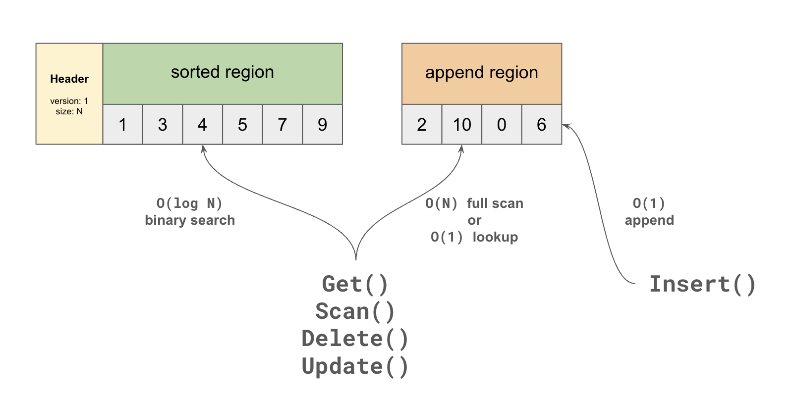
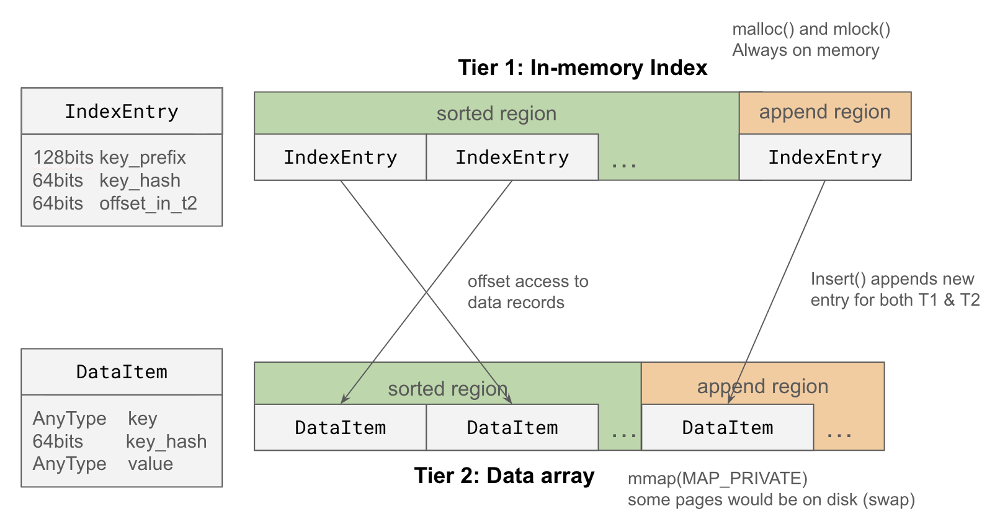
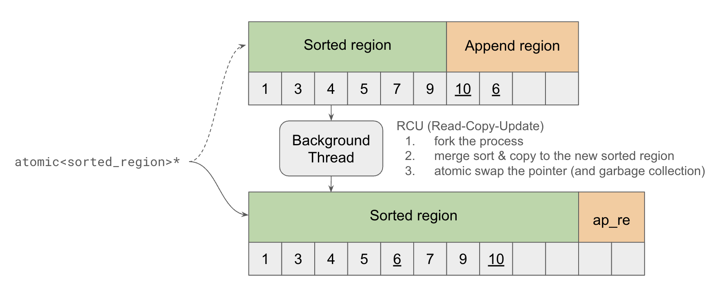
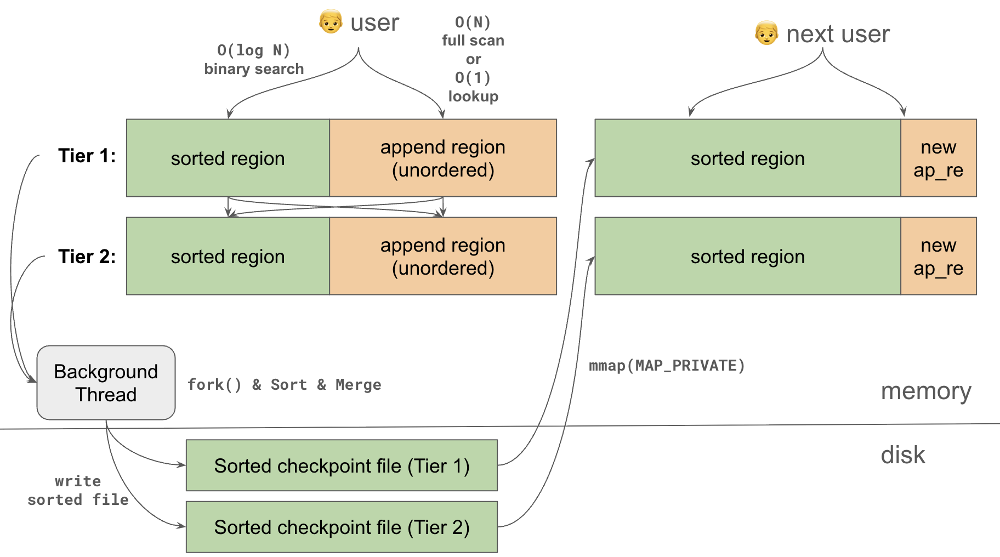

# VMemKV High Level Design

## 1. 概要

VMemKV は、データ管理を OS の仮想メモリ機構（`mmap`, `fork`, `mincore`, `madvise`）へ可能な限り委譲する Larger-than-memory KVS である。
VMemKV は、以下のコンポーネントから成り立つ。

- Tier 1: RAM 常駐のインデックス層
- Tier 2: file-backed mmap を用いた大容量データ層
- WAL
- Checkpoint
- Background Jobs

VMemKV の狙いは、buffer pool・ページ置換アルゴリズム・複雑な compaction などを OS に任せて、実装を単純に保ちながら実運用が可能な性能を確保することにある。
競合を挙げると、LSM-Tree (RocksDB, LevelDB) に比肩する性能を持ちながら、Bitcask のようにシンプルな設計で、LMDB よりも大規模データを扱えることを目指す。

## 2. Features と Limitations

### 2.1 できること

- Larger-than-memory なデータ運用
- Get / Insert / Update / Delete / Scan の KVS API
- WAL と checkpoint による durability

### 2.2 できないこと

- 複数操作をまとめたトランザクション処理
- ファントム回避

## 3. 共通アーキテクチャ: Reorganizing Two-Region

VMemKV の中核となる概念は、`sorted_region` と `append_region` の 2 領域を持ち、定期的な `reorganize` によって `append_region` を `sorted_region` に吸収する `Reorganizing Two-Region` 構造である。

- `sorted_region`: ソート済み領域。検索が O(log N)．
- `append_region`: unorderedでinsertを受ける領域．検索は O(N) だが書き込みが O(1)．

この構造の基本挙動は次のとおりである。

- `insert` は新しい entry を `append_region` に追加する
- 読み取りは `sorted_region` と `append_region` の両方を見る
- `update` と `delete` は、対象 entry が見つかれば基本的に in-place update する
- `reorganize` では `append_region` の内容を `sorted_region` に統合し、古い版や不要 entry を除去する

この構造により、通常時の insert path は単純な append になり、update path は既存 entry への in-place update になる。
したがって、LSM-tree のように update のたびに新しい版を積む設計（イミュータブル）ではない．

## 4. 二層アーキテクチャ

VMemKV は、この `Reorganizing Two-Region` を性質の異なる 2 つの層に適用して構成される。

### 4.1 Tier 1

Tier 1 は fixed-size インデックス層である。
`IndexEntry` は `key prefix + key hash + offset` を持ち、point lookup と range scan の起点になる。key hash はフルキーをハッシュ化したもので，オフセットは後述するTier 2 におけるデータの位置を示す．

Tier 1 固有のポイントは以下

- fixed-size entry なので、高密度な配列として保持しやすい
- `sorted_region` は key 順のIndexEntry配列、`append_region` は unorderedなIndexEntry配列．
- すべての操作が触るホットな層なので、`mlock` や huge page などのメモリ最適化対象になる

### 4.2 Tier 2

Tier 2 は可変長 value 層である。
Tier 1 から渡される `offset` で参照され、実際の key/value record を保持する。

Tier 2 固有のポイントは次の程度である。

- variable-size record を扱う
- `sorted_region` は `reorganize` 後に生まれるプライマリキー (T1の順序）でソート済みのvalue record の配列であり、`append_region` は 直近で insert されたvalue record の配列である．
- Tier 2 は `sorted_region` と `append_region` がどちらも配列であり，同じオフセットで参照する．すなわち，`sorted_region` の冒頭がoffset 0であり，その末尾+1が `append_region` の開始地点となる，単一の巨大な配列となる．
- `update` は可能なら in-place update するが、record サイズが既存の割り当てサイズを超える場合に `insert` になる
- larger-than-memory 性と durability の中心を担う

Tier 1 と Tier 2 の責務分離と、`offset` で両者を接続するレイアウトを示す。

## 5. 操作の例

### 5.1 Get

1. Tier 1 の `sorted_region` / `append_region` を検索し、候補 `IndexEntry` を得る．

- 計算量は `append_region` でヒットした場合は O(N), `sorted_region` からヒットした場合は追加で O(log N)．ミスした場合は O(N) + O(log N)．
- ただし，`append_region` を map にすることでO(N)を O(1)にできる．これは最適化であるためlow level designに記す．

2. hash を照合する

- prefix 一致だがそれ以降が異なるキーを区別するために照合する．

3. `offset` を用いて Tier 2 の record を参照する

- Tier 2 は `sorted_region` と `append_region` がどちらも配列であり，同じオフセットで参照可能なため．どちらのregion にあろうとアクセス可能

4. フルキー一致を確認して返却する

- prefix, hash 一致だが実際のキーは異なる場合を区別するために照合する．

### 5.2 Insert

1. `Get()` によってすでにエントリが存在するか確認
2. WAL append + `fsync`
3. Tier 2 `append_region` に value record を追加し，offsetを得る
4. Tier 1 `append_region` に `IndexEntry` を追加し，その offset を書く

### 5.3 Update / Delete / Scan

- Update: `Get()` でエントリを特定し，WAL 書き込みを行い、Tier 2 が in-place update 可能なら既存 record を更新し、不可能なら Tier 2 append + Tier 1 offset 更新を行う
- Delete: `Get()` でエントリを特定し，WAL書き込みを行い，Tier 1 上で offset を tombstone にする．Tier 2 にはアクセスしない．
- Scan: まず Tier 1 で範囲を絞り込み、得られた offset 集合を使って Tier 2 で value records を収集して返す

Update についても Delete についても，古いデータの削除は　T1の offset を書き換えるだけで行われるのが重要なポイントである．T1 の offset がポインタ/参照だとみなしたとき，これらのT2の削除されたデータは参照カウントがゼロになったものといえる．これらは，後述する `reorganize()` で物理削除される．

## 6. Reorganize, Checkpoint, Live Reload

### 6.1 reorganize と断片化

VMemKV が解消したい断片化は 2 種類ある。

- Ordering Fragmentation: `append_region` は unordered なので、この領域が大きくなると Scan 性能が劣化する．
- Storage Fragmentation: Tier 1 / Tier 2 ともに Delete や append update を繰り返すとoffsetで参照されていない古いデータが残り、領域を圧迫する

`reorganize` はこのニーズに応える．

- T1の reorganize:
  - `append_region` と `sorted_region` をマージし，ソートすることで Ordering Fragmentation を解消する．このとき，offset が tombstone のエントリ（Delete済みのもの）はスキップする．
- T2の reorganize:
  - T1の `sorted_region` の順序で T2からデータをコピーし， T2の`sorted_region`を再構築する．
  - T1 の `append_region` の要素について， T2 からデータをコピーし，T2の `append_region` を再構築する．
  - これらの処理において，かつての tombstone はT1にはすでに含まれず，また，参照offsetが切れているT2のrecordはコピーされないため，Storage Fragmentation が解消される．

T1 の reorganize はT2とは独立して実行できる．すなわち，T1の `reorganize()` を高頻度で実施してもよい．しかし，T2の `reorganize` はオフセット（位置）の変更を伴うため，T1の `reorganize` とセットで実行しなければならない．この時の並行処理については，6.2節で詳しく述べる．

Tier 1 は単独 `reorganize` により ordering fragmentation を軽く抑えられる。
Tier 2 は checkpoint 時の再配置により storage fragmentation をまとめて解消する。
また、Tier 1 の順序に従って Tier 2 を並べ直すことで、scan 性能も向上する。

### 6.2 live reload　& checkpoint

VMemKVの `reorganize` の一連の処理の結果として，T1, T2 それぞれについて，新規に `sorted_region` と `append_region` が生まれることになる．これを現在使用中のものと差し替えるにあたって，二つの問題がある．

1. 停止時間を最小化したい．`reorganize` のために二つの region をフルスキャンすることになるが，その際にはオンラインで読み取りたい．短時間のstop-the-worldにしたい．
2. メモリ領域を大幅に圧迫する．フルスキャンしたうえでフルコピーを行うため，キャッシュラインに与える影響は大きく，`reorganize` 中の性能劣化は避けられない．T1は軽量のためフルスキャン＆フルコピーしても性能影響は限定的だが，T2のそれは非常に問題である．

この二つの問題を解決するため，VMemKVでは，**T2のreorganize が行われる際には必ずcheckpointingを行い，ファイルを介してlive reloadする**ことで，メモリ消費を抑えつつ永続化を行う．これを `checkpoint reload` と呼ぶ．以下のフローで行う．

1. 新規のチェックポイントファイル (T1, T2で2ファイル) を作成する．
2. `fork` で CoW スナップショットを取る
3. `fork` 直後の child 側スナップショットにおける LSN を保存する．
4. T1の `reorganize()` を行う．二つのregion をソート＆マージした新たな領域を作成する．
5. T2の `reorganize` を行う．T1のマージ後の`sorted_region` の順にT2にアクセスし，そのデータをT2のチェックポイントファイルに書き込む．同時に，T1のoffsetを書き換えていく．
6. T1のデータをT1のチェックポイントファイルに書き出す．
7. チェックポイントファイルが完成したら，親プロセスへのクライアントのアクセス (Get, Scan, Insert, Update, Delete) をすべて止める．
8. `mmap(MAP_PRIVATE)` でT1, T2のチェックポイントファイルを開き，新たな T1, T2 とする．T1のファイルは `mlock` する．
9. `fork` 時に記録した LSN の次のエントリから，stop-the-world 中に親プロセス側で確定した現在の LSN までの WAL は未適用であるため，これをリプレイし，新たな T1, T2 に反映して同期をとる．
10. クライアントのアクセスを解放する．
11. チェックポイント済みのWALを削除する．

TODO: ジャイアントロックでfork後に追加されたエントリの同期をとるところ，ロックなしで実装できないか？一旦ロックありでいいと思うが．

### 6.3 reorganize と checkpoint reloadの違い

`reorganize` と checkpoint reloadは強く関連するが、同一の操作ではない。後者が前者に依存している．

- `reorganize`: 各 tier の `append_region` を `sorted_region` に吸収し、**断片化**を解消するための処理
- checkpoint reload: 永続化済みの一貫した世代を新たに作り、**durability**を保証する処理 (checkpoint)．また，reorganize後のT2のデータをチェックポイントファイルを介して`mmap` で読み込むことで，メモリ負荷を抑えるアプローチ (reload)．

この分離は重要である。特に Tier 1 はホットなインデックス層なので、読み性能を維持しするために checkpoint より高い頻度で単独 `reorganize` される。したがって，Tier 1 は「チェックポイントファイルを書き出さない reorganize」も存在する．

一方 Tier 2 の `reorganize` は必ずチェックポイントを伴う．

## 7. 障害耐性と WAL

以下の要素で、VMemKV は永続性を保証する。

- すべての更新は WAL を先行永続化する
- 障害時は checkpoint の読み込み + WAL replay で復旧する
- checkpoint 完了後は古い WAL と checkpoint を削除しローテートする

## 8. 最適化の全体像

いくつかの最適化が存在する。すべて独立の opt-in で、無効でも正しく動作する。
詳細は [low_level_design.md](./low_level_design.md) を参照。

- Tier 1 `mlock` / `MADV_HUGEPAGE` / 一時的 `MADV_SEQUENTIAL`
- Group Commit / Early Lock Release / Flush Pipelining
- SIMD による Tier 1 scan 高速化
- T1 の `append_region` の hashmap化による Get の O(1) 化
- `sorted_region` ネガティブルックアップ用 Bloom filter による miss時の O(1)化
- Tier 2 `MADV_WILLNEED` prefetch

## Appendix A. LineairDB との関係

VMemKV は LineairDB の KVS 部分を置き換える想定で設計される。

- As-is: lock-free hashtable, PLI, WAL, CPR など複数要素で KVS を構成
- To-be: VMemKV 単体を KVS 本体として使用

LineairDB は VMemKV に concurrency control やテーブル・セカンダリインデックス機能を提供するラッパーとして扱われることになる。

## TODO

- セカンダリインデックスのための設計を追加すべき
  - セカンダリインデックスは T2 を持たなくてもいい。セカンダリの T1 `IndexEntry` からプライマリの T1 `IndexEntry` に飛べればよい。`IndexEntry` の prefix を 64 bits にして、余った 64 bits にプライマリへの参照を持たせるのも良いだろう。ただし構造体のサイズは (AVX 命令の都合上) 32 bytes に揃えたいので、それ以上の領域は割けない。
- `mmap` I/O エラーは `SIGBUS` として扱うため signal handler 設計が必要
