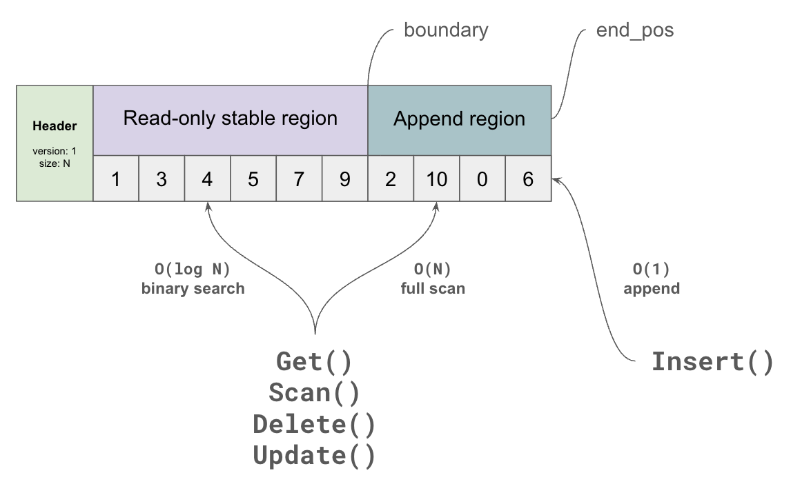

# FaultKV High Level Design

## 1. 概要

FaultKV は、データ管理を OS の仮想メモリ機構（mmap, fork, mincore, madvise）へ可能な限り委譲する Larger-than-memory KVS である。
FaultKVは、以下のコンポーネントから成り立つ。

- Tier 1: RAM 常駐のインデックス層
- Tier 2: file-backed mmap を用いた大容量データ層
- WAL
- Checkpoint
- Background Jobs

FaultKVの狙いは、buffer pool・ページ置換アルゴリズム・複雑なコンパクションなどをOSに任せて、実装を単純に保ちながら実運用が可能な性能を確保することにある。
競合を挙げると、LSM-Tree (RocksDB, LevelDB) に比肩する性能を持ちながら、Bitcask のようにシンプルな設計で、LMDB よりも大規模データを扱えることを目指す。

FaultKVが有用な条件:

- 比較的遅いストレージ（クラウド VM 等）
- hot set が RAM に収まる

FaultKVが不利な条件:

- 超低遅延ストレージ
- hot set が RAMに収まらない / 一様分布

この条件はマイクロベンチマークの性能評価の結果に基づいている。評価については [microbenchmark/REPORT.md](../../microbenchmark/REPORT.md) を参照。

## 2. Features と Limitations

### 2.1 できること

- Larger-than-memory なデータ運用
- Get / Insert / Update / Delete / Scan の KVS API
- WAL とチェックポイントによる Durability

### 2.2 できないこと

- 複数操作をまとめたトランザクション処理
- 完全なファントム回避（必要なら外部ロック機構を併用）

## 3. 設計の中核: SnapLog

FaultKV の中核は SnapLog と呼ばれる二層構造のログである。
SnapLog は以下 2 領域を持つ。

- `ro_region`: sorted / read-only
- `ap_region`: unsorted / read-write / append-only

挙動の要点:

- 読み取りは ro_region から O(log N) で、ap_region から O(N) で行う
- 書き込みは ap_region の末尾に常に追記
- バックグラウンドマージで ap_region を ro_region へ統合しコンパクション

これにより、書き込み経路を単純化しつつ、読み取り性能の劣化を抑える。

## 4. 二層アーキテクチャ

FaultKVは、SnapLogを２つ並べた二層構造を採用する。

### 4.1 Tier 1 (memtable)

- `SnapLog<IndexEntry>`
- key prefix + key_hash + Tier 2 におけるoffset を保持
- mlock で固定してページアウトを回避

### 4.2 Tier 2 (giant buffer)

- 可変長 key/value の実体領域
- file-backed mmap により larger-than-memory を実現

Tier 1 と Tier 2 の責務分離と、offset で両者を接続するレイアウトを示す。

## 5. 操作の例

### 5.1 Get

1. Tier 1 で key prefix を検索
2. hash を照合
3. Tier 2 offset を参照
4. フルキー一致を確認して返却

### 5.2 Insert

1. WAL append + fsync
2. Tier 2 append
3. Tier 1 append

### 5.3 Update / Delete / Scan

- Delete: WAL 書き込み、Tier 1 の offset値 を tombstone 値へ更新。tombstone 値はTier 1 で読み飛ばされる
- Update: WAL 書き込み、in-place 可能なら上書き、不可能なら Delete -> Insert
- Scan: Tier 1 でIndexEntryを収集し、Tier 2にGetを繰り返す

## 6. Checkpoint と Live Reload

FaultKVのCheckpoint は耐久性確保だけでなく、２つの断片化を解消する。
- Ordering Fragmentation: SnapLog の ap_region はunordered で、この領域が大きくなると Get / Scan 性能が劣化する。これを Ordering Fragmentation と呼ぶ。
- Storage Fragmentation: Tier 1 / 2 ともに Delete を実施するたびに古いエントリが残り続け、ストレージを圧迫する。これを Storage Fragmentation と呼ぶ。

fork と checkpoint file を介した live reload の世代切替フローを示す。

1. WAL ローテーション
2. fork で CoW スナップショット
3. 子プロセスで新 checkpoint ファイルを作成
4. Tier 1 の ソート順序で Tier 2 を再配置し新 checkpoint へ書き込み
5. 親プロセスで新世代を読み込み、アトミック切替

この処理の結果、T1 / T2 ともに `ro_region` のみの構成となり、両種の断片化が解消される。
また、T2 の `ro_region` がキーの順序で並ぶため、Scan 性能も大幅に向上する。

## 7. 障害耐性と WAL

以下の要素で、FaultKVは永続性を保証する。

- すべての更新は WAL を先行永続化
- 障害時は チェックポイントの読み込み + WAL リプレイで復旧
- チェックポイント完了後は古い WAL とチェックポイントを削除しローテート

すなわち、再起動の処理は Live Reload の処理と完全に共通する。

## 8. 最適化の全体像

いくつかの最適化が存在する。すべて独立のオプトインで、無効でも正しく動作する。
詳細は [low_level_design.md](./low_level_design.md) を参照。

- Tier 1 mlock / MADV_HUGEPAGE / 一時的 MADV_SEQUENTIAL
- Group Commit / Early Lock Release / Flush Pipelining
- SIMD による Tier 1 スキャン高速化
- ap_region 用 lookup index
- sorted 領域 Bloom filter
- Tier 2 MADV_WILLNEED prefetch

## Appendix A. LMDB とのアーキテクチャ比較

| 観点 | FaultKV | LMDB |
| --- | --- | --- |
| 基本構造 | 2 層 SnapLog（append + merge） | mmap 上の B+tree |
| 更新戦略 | append 中心、後段再編成 | ページ copy-on-write |
| 書き込みモデル | WAL + checkpoint 主体 | single-writer commit |
| 読み取り経路 | Tier 1 絞り込み + Tier 2 検証 | B+tree 探索 |
| 再編成 | checkpoint 時に全体再配置 | ページ再利用中心 |
| 並行性 | 複数 writer を設計対象にしやすい | multi-reader / single-writer |

## Appendix B. LineairDB との関係

FaultKV は LineairDB の KVS 部分を置き換える想定で設計される。

- As-is: lock-free hashtable, PLI, WAL, CPR など複数要素でKVSを構成
- To-be: FaultKV 単体を KVS 本体として使用

LineairDBはFaultKVにConcurrency Controlやテーブル・セカンダリインデックス機能を提供するラッパーとして扱われることになる。

## TODO

- セカンダリインデックスのための設計を追加すべき
    - セカンダリインデックスは T2 を持たなくてもいい。 セカンダリのT1 IndexEntry から プライマリのT1 IndexEntryに飛べればよい。IndexEntry の prefix を64bits にして、余った64bits にプライマリへの参照を持たせるのも良いだろう。ただし構造体のサイズは (AVX命令の都合上) 32 bytes に揃えたいので、それ以上の領域は割けない。
- - mmap I/O エラーは SIGBUS として扱うため signal handler 設計が必要