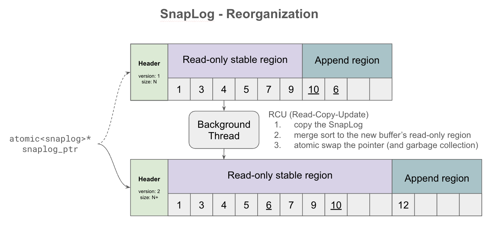
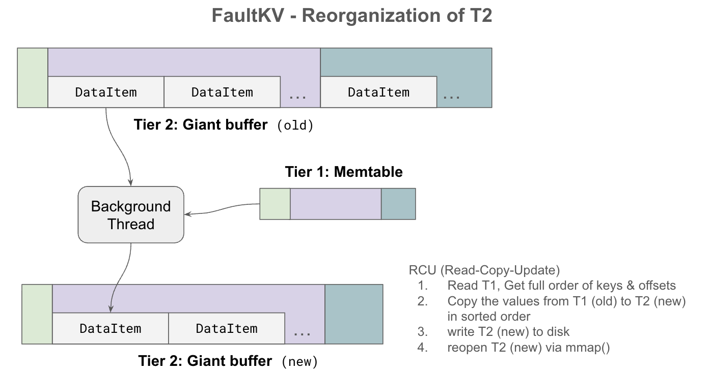

# VMemKV Low Level Design

## 1. SnapLog<T>

```c++
template <typename T>
struct SnapLog {
  private:
    std::atomic<T>* ro_region{nullptr};
    std::atomic<T>* ap_region{nullptr};
    std::atomic<size_t> boundary_pos{0};
    std::atomic<size_t> end_pos{0};

    std::function<bool(const T&, const T&)> comparator;
    std::thread background_merger;

    std::atomic<size_t> epoch{0};
    static thread_local size_t local_epoch{0};
    std::vector<SnapLog*> old_snaps;

    
  public:
    T& at(size_t i);
    void append(const T& entry);
    void scan(std::function<bool(const T&)> func);
    void reorganize();
};
```


| Fields              | Description                                                                                                  |
| ------------------- | ------------------------------------------------------------------------------------------------------------ |
| `ro_region`         | 読み取り専用リージョン。ソート済み。                                                                         |
| `ap_region`         | 読み書き可能なリージョン。unsortedで，単調増加してInsertされる．                                             |
| `boundary_pos`      | `ap_region` が始まる論理インデックス。`ro_region` との境界．                                                 |
| `end_pos`           | 最後に挿入されたエントリの次のインデックス（`== boundary + ログエントリ数`）。                               |
| `comparator`        | エントリをソートするための比較関数。                                                                         |
| `background_merger` | バックグラウンドで `ap_region` を `ro_region` にマージするスレッド。                                         |
| `epoch`             | ガベージコレクションのためのエポックカウンタ。新しいSnapLogが有効化されるたびにインクリメントされる。        |
| `local_epoch`       | スレッドローカルなエポックカウンタ。各スレッドはこの値を参照してガベージコレクションのタイミングを決定する。 |
| `old_snaps`         | 古いSnapLogのリスト。ガベージコレクションの対象となる。                                                      |

**Primitives:**

| Primitive       | Description                                                                                                                                                   |
| --------------- | ------------------------------------------------------------------------------------------------------------------------------------------------------------- |
| `at(i)`         | `i < boundary_pos` なら `ro_region[i]` を、そうでなければ `ap_region[i − boundary_pos]` を返す。                                                              |
| `append(entry)` | `entry` を `ap_region` の末尾に追加し、`end_pos` をインクリメントする。                                                                                       |
| `scan(func)`    | `ro_region` と `ap_region` の全エントリに対して `func` を適用し，ヒットするエントリを返却する．`ro_region` からは二分探索，`ap_region` からは線形探索を行う。 |
| `reorganize()`  | `background_merger` スレッドを起動し、`ap_region` のエントリをマージして `ro_region` に統合する。                                          


ro_region と ap_region それぞれの探索・追記コストと基本操作の対応を示す。


SnapLog のreorganize() の挙動を示す。ap_region を ro_region にマージしてソートされた状態で統合する。


## 2. VMemKV の物理レイアウト

```cpp

class VMemKV {

    // 32バイト構造体 — 64B キャッシュラインに2エントリ収容
    struct IndexEntry {
        uint64_t key_prefix[2]; // 16バイトキープレフィックス（主ソートキー）
        uint64_t hash;          // フルキーのハッシュ値。T2のルックアップキー
        std::atomic<uint64_t> offset;        // T2 への論理バイトオフセット。UINT64_MAX = 墓石（削除済み）
        constexpr static uint64_t DELETED_OFFSET = UINT64_MAX;
    };

    struct ValueEntry {
        uint32_t key_len;
        uint32_t value_len;
        seqlock latch; // In-place update のためのエントリレベルのsequence lock
        char data[];  // 可変長keyと可変長のvalueのペイロード。レイアウトは [key][value]。
    };

  private:
    using T1 = SnapLog<IndexEntry>;  // Tier 1: 固定長インデックス配列
    std::atomic<T1*> t1;
    using T2 = SnapLog<AppendBuffer>;       // Tier 2: 生のキーバリューバイト列
    std::atomic<T2*> t2;
};
```


## 3. Operations

- **Get:**
  1. `t1.scan()` で `key_prefix` が一致するエントリを収集し，`hash` と `hash(key)` を比較して `IndexEntry` を特定する．見つからなければ `NOT_FOUND` を返す．
  2. `t2.at(offset)` で `ValueEntry` を取得し，`key` が一致していることを確認して返却する． `key` が一致しない場合はハッシュ衝突であり，`NOT_FOUND` を返す．
- **Insert:**
  1. WAL に書き込み `fsync` する。
  2. 新たなValueEntryを作成する． `t2.append()` で Tier 2 に追記する．このときの論理オフセットを記録する．
  3. 新たなIndexEntryを作成する． `t1.append()` で Tier 1 に追記する．
- **Update:**
  1. `Get()` で既存のT2のValueEntryを取得する。見つからなければ `NOT_FOUND` を返す。
  2. WAL に書き込み `fsync` する。
  3. 既存エントリのサイズによって分岐．
  - **In-place update:** 新しい値が既存エントリのサイズ以下の場合。`ValueEntry` の値を上書きする。
  - **Append update:** 新しい値が既存エントリのサイズを超える場合。新たな `ValueEntry` を作成し、`t2.append()` で Tier 2 に追記する。このときの論理オフセットを記録する。次に、Tier 1 の `IndexEntry` の `offset` を新しいオフセットに更新する。
- **Delete:**
  1. `Get()` で既存のT2のValueEntryを取得する。見つからなければ `NOT_FOUND` を返す。
  2. WAL に書き込み `fsync` する。
  3. Tier 1 の `IndexEntry` の `offset` を `DELETED_OFFSET` に更新することで、削除されたことを示す。Tier 2 の `ValueEntry` はそのまま残るが、到達不能なtombstoneとなる。
- **Scan `[start_key, end_key]`:**
  1. `t1.scan()` で `key_prefix` が `[start_key, end_key]` の範囲にあるIndexEntryを収集する。
  2. 各IndexEntryについて，`t2.at(offset)` で `ValueEntry` を取得し、`key` が `[start_key, end_key]` の範囲内にあることを確認して返却する。

## 4. バックグラウンド処理

各バックグラウンド処理に専用のスレッドを割り当てる．

- **T1 Background Merge:**
  - `t1.ap_region` のエントリ数が `T1_UNSORTED_APPEND_REGION_DELTA_THRESHOLD` を超えた場合にトリガーされる．
  - `t1.end_pos` をスナップショットし，`ep` として保存する．
  - 新たな `t1` 構造体を作成し、`t1.ro_region` と `t1.ap_region` をマージして `t1.ro_region` にソートされた状態で格納する。
    - 新しい `t1` の `ap_region` は空の新たな領域を `malloc` する。
    - `boundary` は `ap_region` の開始位置に更新される。
    - `end_pos` は `ro_region` のエントリ数に更新される。
  - ここから，古い `t1` への書き込みをブロックする．
    - 古い `t1` の `ap_region[ep, end_pos)` にある，マージ中に発生したエントリを新しい `t1` の `ap_region[0, ...)` にコピーする。これにより、マージ中に発生した書き込みが失われないようにする。
    - `t1` をアトミックに新しい構造体に置き換える。
    - 新たな構造体の `ap_region` に書き込みを許可する．
  - 古い `t1` は `old_snaps` に追加され，すべてのスレッドが新しい `t1` に切り替わったことを確認した後に解放される。
- **T1 & T2 チェックポイント:**
  - 新しい WAL ファイルを作成する。
  - `fork()` で子プロセスを生成し、メモリの CoW スナップショットを取得する。
  - `t1` の Background Merge を行う．
  - `t1` の `ro_region` をフルスキャンしながら、キーの順序で `t2` の `ValueEntry` を新しいチェックポイントファイルにコピーする。削除されたキー（tombstone）をスキップする。`t1` のオフセットを `t2` の新しいオフセットに置き換える。
  - チェックポイントファイルのヘッダーを更新し，torn write がないことを保証する．
  - チェックポイントファイルを永続化する。
  - 古い WAL ファイルを削除する。
- **Live Reload:**
  - チェックポイントファイルを `mmap()` して新しい `t1` と `t2` の構造体を構築し、アトミックに切り替える。
  - 古い `t1` と `t2` は `old_snaps` に追加され，すべてのスレッドが新しい構造体に切り替わったことを確認した後に解放される。
  - 切り替え中に発生した書き込みは，切り替え後の `t1` と `t2` の `ap_region` にコピーする。これにより、切り替え中の書き込みが失われないようにする。


Tier 1 の順序に従って Tier 2 を再配置する checkpoint 時のデータ移送手順を示す。


## 5. 最適化仕様（オプトイン）

本節の最適化はすべてオプトインであり、互いに独立している。§5 で説明したシステムはこれらを一切有効化しなくても正しく動作する。各最適化は特定の性能特性を改善する。

VMemKVに以下の追加フィールドを導入する．

```c++
    std::atomic<uint64_t> t2_live_entries{0};  // レコード数: アクティブな（削除されていない）キーバリューペア数
    std::atomic<uint64_t> t2_append_count{0};  // レコード数: 直前の Live Reload 以降の Insert + Update 操作の累計数
```

### 6.1 Tier 1 メモリヒント

Tier 1 はすべての操作でアクセスされる最もホットなデータ構造であるため、起動時にページを固定・最適化する。

- **`mlock(t1, size)`:** Tier 1 の全ページを物理 RAM に固定し、大きな Tier 2 バッファによるメモリ圧迫下でも OS がスワップアウトするのを防ぐ。
- **`madvise(t1, size, MADV_HUGEPAGE)`:** 二分探索時の TLB 圧力を下げるため、Tier 1 配列に Transparent Huge Pages（2 MB ページ）を要求する。ヒュージページの分割を防ぐため `mlock()` と併せて適用する。
- **`MADV_SEQUENTIAL`（一時的）:** シーケンシャル全スキャン（チェックポイント書き込みおよびbackground index merge）の直前に Tier 1 へ適用し、アグレッシブな先読みを有効化する。

### 6.2 Group Commit & Early Lock Release & Flush Pipelining

詳細は [Aether](https://dl.acm.org/doi/10.14778/1920841.1920928)を参照．

1. 各ライターは共有 WAL バッファにレコードを追記し、ウェイターとしてエンキューする。この時点でエントリのラッチを解放し，読み書き可能にする． (Early Lock Release)
2. 読み取りを行うスレッドも空のウェイターをエンキューする。これにより，未flushのデータを読んだトランザクションは，書き込みが失敗した場合にアボートされるため，Read uncommitted は発生しない (Flush Pipelining)。
3. 専用のリーダーがグループ全体を代表して `fsync` を呼び出す。 (Group Commit)
4. 専用のスレッドがウェイターを順番にデキューし、`fsync` が完了したことを通知する。これにより、グループ内のすべてのトランザクションがコミットされたことが保証される。

これにより、耐久性保証を緩めることなく `fsync` コストを償却する．
`WAL_SYNC_MODE: GROUP_COMMIT` で制御。

### 6.3 SIMD 高速化 Tier 1 スキャン

`IndexEntry` は 32 バイトで配列は連続かつ mlock 済みのため、Tier 1 の線形スキャン（Scan での`ap_region` スキャン、Background Index Merge）はメモリバウンドではなく CPU バウンドである。AVX-512 は 1 命令で 16 個の `key_prefix` を比較でき、スカラーコードと比較してレンジフィルタリングおよびソートパスで 8〜16 倍のスループットを達成する。

### 6.4 `ap_region` 用ルックアップインデックス（`t1_unsorted_lookup`）

T1 の **log リージョンのみ**をカバーするロックフリーなオープンアドレッシングハッシュマップ（`hash` → `t1_index`）。

有効化時、Get と Update は O(N) の `ap_region` に対する線形スキャンを単一の O(1) インデックスプローブで置き換える。`t1_unsorted_lookup[hash]` がインデックス `i` を直接返し、`t1.at(i)` で検証する。

- 容量は確保時に固定される。衝突は線形プロービングで解決する。
- Background index merge のたびにクリア（新しい空のテーブルに置き換え）する。

### 6.5 T1用 Bloom フィルタ（`t1_sorted_bloom`）

単一の Bloom フィルタ（`t1_sorted_bloom`）が`ro_region` のキーをカバーする．ネガティブルックアップは， `ro_region` についてはこのブルームフィルタで， `ap_region` については先述のハッシュテーブルで実行するためともに $O(1)$ になる。フィルタはBackground Index Merge時に再構築される。

### 6.6 Tier 2 プリフェッチ (`madvise(MADV_WILLNEED)`)

Scan 時に、Tier 1 から収集したオフセット群に基づいてどの Tier 2 ページにアクセスするかを予測できる。各オフセットに対応する Tier 2 ページに対して `madvise(MADV_WILLNEED)` を事前に発行し、OS が次のステップの前に非同期でロードできるようにする。

## 7. パラメータ

- `T1_MAX_INDEX_SIZE`: Tier 1 インデックス配列の最大エントリ数。確保される実際のメモリ量は `T1_MAX_INDEX_SIZE × 32` バイト。キースペース全体を収容できる十分な値を設定しなければならない。
- `T1_UNSORTED_APPEND_REGION_DELTA_THRESHOLD`: バックグラウンドインデックスマージのトリガー閾値。
- `T2_MAX_VIRTUAL_MEMORY_SIZE`: Tier 2 の最大仮想アドレス空間サイズ。
- `T2_CHECKPOINT_INTERVAL_SEC`: `fork()` ベースのチェックポイント実行間隔（秒）。
- `T2_SPACE_FRAGMENTATION_THRESHOLD`: 空間断片化（墓石）の閾値。
- `T2_ORDERING_FRAGMENTATION_THRESHOLD`: 順序断片化（スキャン性能）の閾値。
- `WAL_SYNC_MODE`: WAL の `fsync` ポリシー（例: `EVERY_WRITE`、`PERIODIC`）。