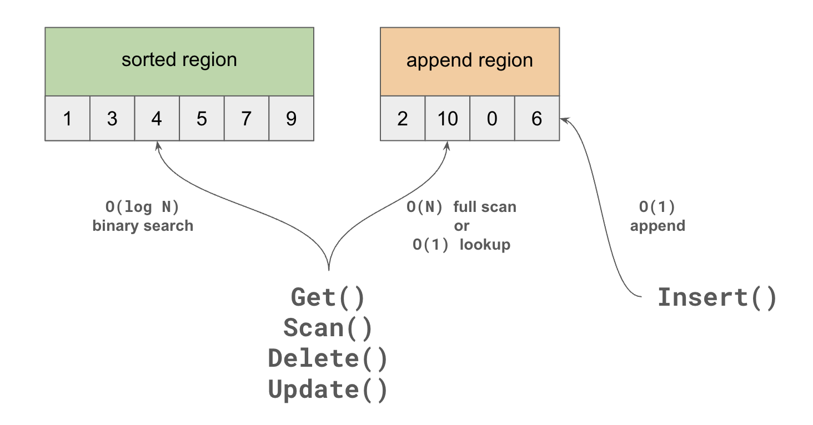
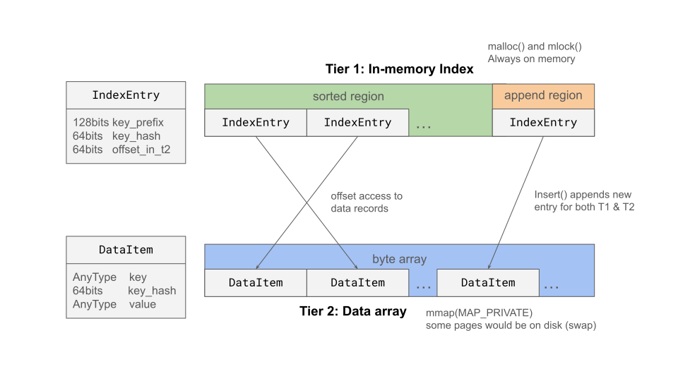
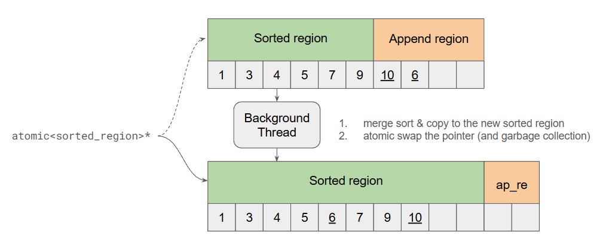
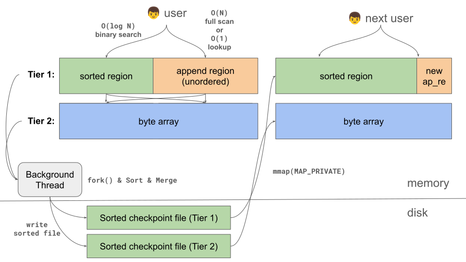

# VMemKV High Level Design

## 1. 概要

VMemKV は、データ管理を OS の仮想メモリ機構（`mmap`, `fork`, `mincore`, `madvise`）へ可能な限り委譲する Larger-than-memory KVS である。
VMemKV は、以下のコンポーネントから成り立つ。

- Tier 1: RAM 常駐のインデックス層
- Tier 2: file-backed mmap を用いた大容量データ層
- WAL
- Checkpoint
- Background Jobs

VMemKV の狙いは、buffer pool・ページ置換アルゴリズム・複雑な compaction などを OS に任せて、実装を単純に保ちながら実運用が可能な性能を確保することにある。
競合を挙げると、LSM-Tree (RocksDB, LevelDB) に比肩する性能を持ちながら、Bitcask のようにシンプルな設計で、LMDB よりも大規模データを扱えることを目指す。

## 2. Features と Limitations

### 2.1 できること

- Larger-than-memory なデータ運用
- Get / Insert / Update / Delete / Scan の KVS API
- WAL と checkpoint による durability

### 2.2 できないこと

- 複数操作をまとめたトランザクション処理
- ファントム回避

## 3. 共通アーキテクチャ: Reorganizing Two-Region

VMemKV の中核となる概念は、`sorted_region` と `append_region` の 2 領域を持ち、定期的な `reorganize` によって `append_region` を `sorted_region` に吸収する `Reorganizing Two-Region` 構造である。

- `sorted_region`: ソート済み領域。検索が O(log N)．
- `append_region`: 未整列で insert を受ける領域。ハッシュインデックスを併用するため、検索は O(1) expected、書き込みも O(1)．

この構造の基本挙動は次のとおりである。

- `insert` は新しい entry を `append_region` に追加する
- 読み取りは `sorted_region` と `append_region` の両方を見る
- `update` と `delete` は、対象 entry が見つかれば基本的に in-place update する
- `reorganize` では `append_region` の内容を `sorted_region` に統合し、古い版や不要 entry を除去する

この構造により、通常時の insert path は単純な append になり、update path は既存 entry への in-place update になる。
したがって、LSM-tree のように update のたびに新しい版を積む設計（イミュータブル）ではない．

## 4. 二層アーキテクチャ

VMemKV は、`Reorganizing Two-Region` を持つ Tier 1 と、Tier 1 の offset から参照される Tier 2 value store によって構成される。

### 4.1 Tier 1

Tier 1 は fixed-size インデックス層である。
`IndexEntry` は `key prefix + key hash + payload` を持ち、point lookup と range scan の起点になる。key hash はフルキーをハッシュ化したものである。base design において payload は後述する Tier 2 の位置を示す `offset` である。

Tier 1 固有のポイントは以下

- fixed-size entry なので、高密度な配列として保持しやすい
- `sorted_region` は key 順のIndexEntry配列、`append_region` は unorderedなIndexEntry配列．
- すべての操作が触るホットな層なので、`mlock` や huge page などのメモリ最適化対象になる

また，opt-in 最適化として，値が 8 バイト以下の entry について payload を `offset` ではなく 64-bit value として解釈する **entry-level adaptive covering** をサポートする．該当 entry では Tier 1 のヒットだけで `Get()` が完結し，Tier 2 アクセスを省略できる．詳細は low_level_design.md 2.1.1 節を参照．

### 4.2 Tier 2

Tier 2 は可変長 value 層である。
Tier 1 から渡される `offset` で参照され、実際の key/value record を保持する。

Tier 2 固有のポイントは次の程度である。

- variable-size record を扱う
- file-backed mmap 上の単一 byte array として保持され、`offset` はその先頭からの byte offset である
- insert や、更新後の value が既存 record の割り当て長に収まらない update では、末尾に新しい record を追記し、その offset を Tier 1 に保存する
- `update` は可能なら in-place update するが、更新後の value が既存 record の割り当て長を超える場合は新しい record への追記になる
- larger-than-memory 性と durability の中心を担う

Tier 1 と Tier 2 の責務分離と、`offset` で両者を接続するレイアウトを示す。

## 5. 操作の例

### 5.1 Get

1. Tier 1 の `sorted_region` / `append_region` を検索し、候補 `IndexEntry` を得る．

- 計算量は `append_region` でヒットした場合は O(1), `sorted_region` からヒットした場合は追加で O(log N)．ミスした場合は O(1) + O(log N)．

2. hash を照合する

- prefix 一致だがそれ以降が異なるキーを区別するために照合する．

3. `offset` を用いて Tier 2 の record を参照する

- Tier 2 は単一 byte array であり、`base + offset` から record を参照できる

4. フルキー一致を確認して返却する

- prefix, hash 一致だが実際のキーは異なる場合を区別するために照合する．

entry がインライン化されている場合は，3. は不要であり，Tier 1 の payload をそのまま返す．

### 5.2 Insert

1. `Get()` によってすでにエントリが存在するか確認
2. Tier 2 の末尾に value record を追加し，offset を得る
3. Tier 1 `append_region` に `IndexEntry` を追加し，その offset を書く
4. WAL append + `fsync`

値が 8 バイト以下でインライン化対象の entry では，2. を省略し，Tier 1 entry の payload に 64-bit value を直接書く．

### 5.3 Update / Delete / Scan

- Update: `Get()` でエントリを特定し、Tier 2 が in-place update 可能なら既存 record を更新し、不可能なら Tier 2 末尾追記 + Tier 1 offset 更新を行ったうえで、WAL 書き込みを行う
- Delete: `Get()` でエントリを特定し，Tier 1 上で offset を tombstone にしたうえで，WAL書き込みを行う．Tier 2 にはアクセスしない．
- Scan: まず Tier 1 で範囲を絞り込み、得られた offset 集合を使って Tier 2 で value records を収集して返す

インライン化されている entry では，Update / Delete / Scan も Tier 1 payload だけで完結する．

payload が offset の index については，Update と Delete における古いデータの削除は T1 の offset を書き換えるだけで行われるのが重要なポイントである．T1 の offset がポインタ/参照だとみなしたとき，これらの T2 の削除されたデータは参照カウントがゼロになったものといえる．これらは，後述する `reorganize()` で物理削除される．

## 6. Reorganize, Checkpoint, Live Reload

### 6.1 reorganize と断片化

VMemKV が解消したい断片化は 2 種類ある。

- Ordering Fragmentation: Tier 1 の `append_region`、ならびにTier 2は unordered なので、この領域へのアクセス回数が増えると Scan 性能が劣化する．
- Storage Fragmentation: Tier 1 / Tier 2 ともに Delete や append update を繰り返すと offset で参照されていない古いデータが残り、領域を圧迫する

`reorganize` はこのニーズに応える．

- T1の reorganize:
  - `append_region` と `sorted_region` をマージし，ソートすることで Ordering Fragmentation を解消する．このとき，offset が tombstone のエントリ（Delete済みのもの）はスキップする．
- T2の reorganize(Defragment、**設計されたが現在はコードベースから削除済み -- 6.3節参照**):
  - T1 の live entry 順に T2 からデータをコピーし，新しい単一 byte array を構築する．
  - コピー先 offset を T1 に書き戻す．
  - これらの処理において，tombstone 化されたエントリは新しい T1 に含まれず，また，参照offsetが切れているT2のrecordはコピーされないため，Storage Fragmentation が解消される．

T1 の reorganize はT2とは独立して実行でき，高頻度で実施してもよい。

Tier 1 は単独 `reorganize` により ordering fragmentation を軽く抑えられる。
Tier 2 の storage fragmentation を解消する仕組みは現在存在しない(Defragment、6.3節参照)。

### 6.2 checkpoint

Tier 2 の稼働中 mmap は `MAP_SHARED` である。書き込みはページキャッシュへ直接反映されるため、checkpoint は tail 領域を `msync()` して物理ディスクへの反映を確定させるだけの、短時間の操作である。新規 append を短く止める以外に停止は発生しない。詳細な手順と正しさの根拠は low_level_design.md 4.3 節・5.3 節を参照。

### 6.3 Defragment [削除済み]

> **現在の状態**: 本節は過去に設計・実装・測定された挙動の記録である。Defragment(`defragment()`/
> `defragment_internal()`)は round 1 で no-op 化された後、round 3 で API ごとコードベースから
> 完全に削除された(`defragment_redesign_proposal.md` §8参照)。Tier 2 の storage fragmentation を
> 解消する仕組みは現在存在しない。以下は将来 Tier 2 再配置が必要になった際の設計参照として残す。

Defragment は Tier 2 の生存データ全件を、T1 の key 順のまま新しい単一 byte array へ再配置し、旧ファイルを置き換える。これを現在使用中のものと差し替えるにあたって、二つの要件がある。

1. 停止時間を最小化する。走査中はオンラインで読み取れる必要がある(atomic pointer swap による無停止化)。
2. メモリ領域を大幅に圧迫しない。フルスキャン・フルコピーを伴うため、キャッシュラインへの影響を抑える設計が要る。

概略は次のとおりである。T1 の `reorganize()` 呼び出しの中で checkpoint LSN を確定し、新しい `sorted_region` と新しい T2 ファイルを一時ファイルへ書き出したうえで、manifest の `rename()` を新世代の有効化点として atomic pointer swap で公開し、最後に不要になった WAL レコードと旧世代のファイルを片付ける。詳細な手順と正しさの根拠は low_level_design.md 4.6 節を参照。

このフローにおいて、旧世代バッファへの書き込みがまだ進行中の状態でマージが進まないよう、pointer swapの直後（マージ開始前）に「一段目のエポック同期バリア」を挟み、旧世代のすべての書き込みスレッドの完了を待機する。

このフローに stop-the-world は存在しない。

## 7. 障害耐性と WAL

以下の要素で、VMemKV は永続性を保証する。

- Tier 1 は純粋な RAM 上構造体であり、それ自体がディスクへ書き戻される経路を持たない。起動のたびに、T1 checkpoint ファイル(存在すれば)と WAL からの replay で再構築される。
- 更新は、まず Tier 2 / Tier 1 に適用し、それが成功して初めて WAL append + `fsync` を行う。呼び出し元への成功応答は WAL の `fsync` 完了後にのみ返す。適用失敗を WAL に残さないための順序であり、詳細な理由は low_level_design.md 3.2 節 Failure Rule を参照。
- 障害時は checkpoint の読み込み + WAL replay で復旧する
- checkpoint 完了後、WAL は low_level_design.md 5.5 節の手順でローテートする

## 8. 最適化の全体像

いくつかの最適化が存在する。すべて独立の opt-in で、無効でも正しく動作する。
詳細は [low_level_design.md](./low_level_design.md) を参照。

- Tier 1 `mlock` / `MADV_HUGEPAGE` / 一時的 `MADV_SEQUENTIAL`（未実装・将来検討）
- Tier 1 `madvise(MADV_RANDOM)`（常時有効。In-Memory 読出で約5%の性能向上に貢献する）
- Group Commit / Early Lock Release / Flush Pipelining（未実装・将来検討）
- SIMD による Tier 1 scan 高速化
- entry-level adaptive covering
- `sorted_region` ネガティブルックアップ用 Bloom filter による miss時の O(1)化
- Tier 2 `MADV_HUGEPAGE`（検証済み・不採用 — スワップ発生時は 2MB 単位を保てず効果なし。詳細は low_level_design.md 7.4.1 節）

## Appendix A. LineairDB との関係

VMemKV は LineairDB の KVS 部分を置き換える想定で設計される。

- As-is: lock-free hashtable, PLI, WAL, CPR など複数要素で KVS を構成
- To-be: VMemKV 単体を KVS 本体として使用

LineairDB は VMemKV に concurrency control やテーブル・セカンダリインデックス機能を提供するラッパーとして扱われることになる。

## TODO

- セカンダリインデックスのための設計を追加すべき
  - セカンダリインデックスは T2 を持たなくてもいい。セカンダリの T1 `IndexEntry` からプライマリの T1 `IndexEntry` に飛べればよい。`IndexEntry` の prefix を 64 bits にして、余った 64 bits にプライマリへの参照を持たせるのも良いだろう。ただし構造体のサイズは (AVX 命令の都合上) 32 bytes に揃えたいので、それ以上の領域は割けない。
- `mmap` I/O エラーは `SIGBUS` として扱うため signal handler 設計が必要
