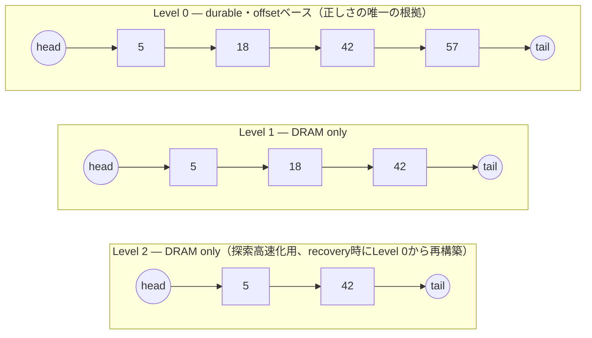
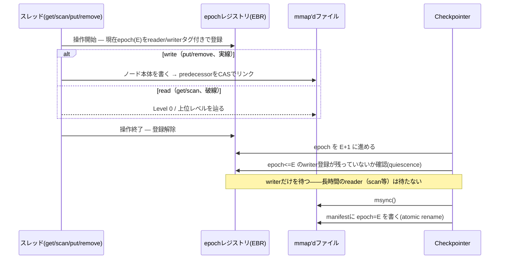
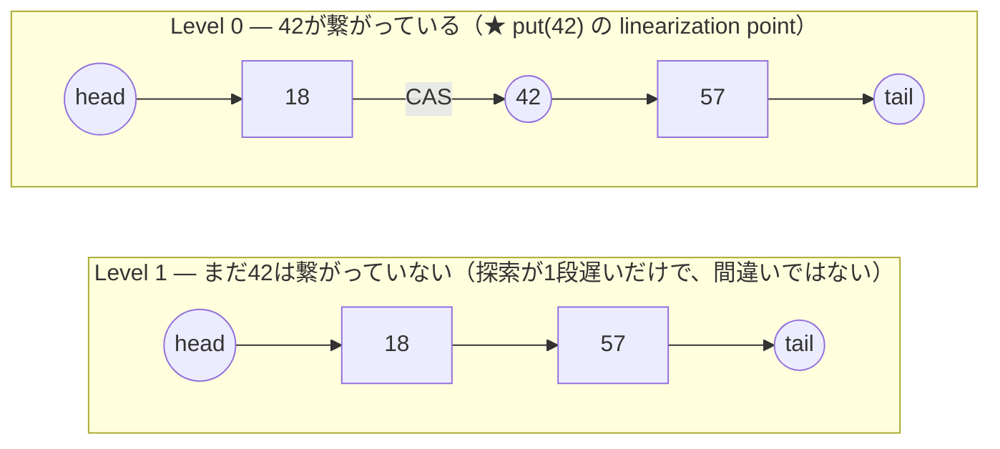
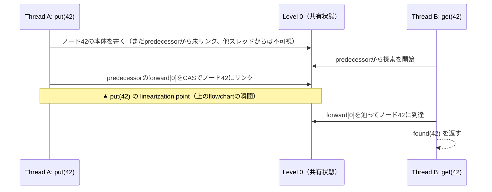

# pskiplist High Level Design

## 1. 概要

`pskiplist` は、**lock-free な並行アクセス**・**mmap+msyncによるcrash-consistency**・
**本物の物理ノード回収(reclaim)**の3つを同時に満たす、offsetベースのpersistent skip
listライブラリである。特定のKVSに依存しない独立したライブラリとして実装する。

設計要素ごとの出典は8章、参考文献一覧は9章を参照。

## 2. データ構造



### 2.1 ノード(durable、Level 0のみ)

```c++
struct DurableNode {
    std::atomic<uint64_t> epoch;    // 作成時のグローバルepoch（crash-safety用）
    Key key;
    Value value;                     // 状態(live/tombstoned-linked/tombstoned-unlinked)を
                                      // value内の専用ビットで表現(4章)
    std::atomic<Offset> forward0;    // Level 0の次ノードへのoffset + 論理削除markビット(4.2節)
};
```

- mmap'dファイルに存在するノードはこれだけ。上位レベルのforwardポインタはここに含まれ
  ない(2.4節)。durableな対象がLevel 0だけなので、参加レベル数に関わらず全ノード同一
  サイズになる。
- ノード間の相互参照は**単一mmap'dファイル内のoffset**(生ポインタではない)。プロセス
  再起動でmmap先の仮想アドレスが変わっても構造が壊れない。
- `Offset`の最上位ビット(bit 63)は、物理unlinkのhelping(4.2節)が使うmarkビットとして
  予約する。実際に表現できるoffset値は下位63ビットの範囲(`kNullOffset`もこの範囲に
  収まるsentinel値)であり、ノード数の実用上の上限に対して十分すぎるほど余裕がある。
- **`Value`は64bit以下の、単語1つでアトミックに書き換えられる型に限る**(`Key`も同様に
  固定長)。より大きなデータを扱いたい場合は、`Value`に呼び出し側管理の外部ストレージへの
  offsetやポインタを自分で埋め込む(pskiplist自身はその先の中身を一切関知しない)。この
  制約が4章の並行アルゴリズムの単純さを直接支えている。
- `value`は実データに加えて**3値の状態(live / tombstoned-linked / tombstoned-unlinked)**
  を専用ビットで持つ。この状態遷移がput/remove/物理unlinkの調停点になる(4章)。

### 2.2 Level 0が正しさの唯一の根拠

- **Level 0**(全生存キーを含む最下段の単方向リスト)だけがdurable。crash後の正しさは
  ここだけで保証する。
- **上位レベル**は検索高速化のためだけの構造で、正しさには無関係。durableである必要は
  なく、recovery時にLevel 0を辿って再構築する。

### 2.3 フリーリスト

全ノードが固定サイズなので、フリーリストは単純な等間隔スロット配列に対する
mark-and-sweepで済む。フリーリスト自体は永続化しない(フリーリストのレコードが
torn writeの対象になる問題を回避するため)——起動時と稼働中で、補充のされ方が異なる。

- **起動時**: recovery時にLevel 0を辿るrecovery walk(2.2節)の副産物として一括導出する
  ——到達できたoffsetの集合が「生存ノード」、確保済み範囲のうちそれ以外が「フリー」。
- **稼働中**: ノードの状態が`tombstoned-unlinked`に遷移し、かつpredecessorの実ポインタも
  物理的に付け替え済みになったら(4.2節)、いったんin-memoryの「unlink待ちキュー」に
  (offset, unlink_epoch)として積む。checkpoint()が新しいepoch`E`をpublishした後、
  このキューを掃き、`unlink_epoch <= E`(3章)かつ、そのunlink epoch以下で登録した
  readerが残っていないものをフリーリストへ移す。reader確認はcheckpoint()の本体とは
  非同期に行う(3章)——これがないと、recoveryを跨がない限りdeleteされた領域が一切
  再利用されず、物理回収(1章)が実質機能しなくなる。

unlink待ちキューもフリーリストも永続化しない——クラッシュで中身が消えても、次回起動時の
recovery walkが「Level 0から到達不能な確保済み領域」を独立に全部見つけ直すため、何も
失われない。

### 2.4 上位レベル(volatile)

各レベル(Level 1以降)を、それぞれ独立したlock-free listとして持つ。skip list全体は
これらのlock-free listの集まりとして構成される。put()は対象ノードが参加する各レベルの
lock-free listへ、bottom-up(Level 0から順に上位へ)でリンクしていく。

- Level 1以降は純粋なDRAM構造で、mmap'dファイルには一切存在しない。プロセス再起動の
  たびにrecovery時のLevel 0走査から作り直す(2.2節)。
- offsetではなく通常のポインタでよい——ASLR安全性やoffsetエンコーディングはLevel 0
  のみの関心事であり、上位レベルには適用されない。
- 確保・解放は通常のC++アロケータでよい(`new`等)。crashをまたいで生存する必要が
  ないため、可変長データ特有のfragmentation・回収問題を心配する必要がない。
- メモリ安全性(reclaim)は3章と同じEBRレジストリを流用する。新しいepochカウンタは
  不要。

### 2.5 レベル生成パラメータ

新規ノードのレベルは幾何分布で決める: レベル1から開始し、確率`p`で次のレベルへの昇格を
`kMaxLevel`に達するまで繰り返す(LevelDB/Redisと同じ手法)。`Config`テンプレート等で
差し替え可能にする(テンプレートパラメータの`Config`構造体経由)が、以下をデフォルト値とする。

| パラメータ | 説明 | デフォルト値 | 大きすぎる場合 | 小さすぎる場合 |
| --- | --- | --- | --- | --- |
| `p`(昇格確率) | 新規ノードがレベル`L`から`L+1`へ昇格する確率。期待レベル数は`1/(1-p)` | `1/4`(RocksDB/LevelDB/Redisで採用されている値) | 期待レベル数が増え、volatile側(2.4節)のメモリ消費とリンク維持コストが増える | 上位レベルが疎になりすぎて近道として機能しなくなり、実質Level 0だけのO(N)線形探索に近づく(p→0で全ノードlevel 1止まり) |
| `kMaxLevel`(上限レベル数) | 昇格を打ち切る最大レベル数 | `32`(Redisと同じ) | 本設計ではdurable側が影響を受けず、volatile側も実際に到達したレベル分しか確保しない(2.1/2.4節)ため実害はほぼない。find()の作業用配列がわずかに大きくなる程度 | 実データ規模に対して`p^(kMaxLevel-1)`が無視できない大きさになると、最上位付近にノードが密集し、探索性能がO(log N)から乖離する(`kMaxLevel=1`なら単なる線形リストと同じ) |

- **決定論性**: コンストラクタでRNGをseed可能にする。テストビルドでは固定seedを使い、
  6章のfault injectionテストの再現性を確保する。
- **並行性**: RNG状態はスレッドローカルに持つ。スレッド間のinterleaving込みでの
  bit-exact再現性は狙わない(6章のテスト設計はもともと1操作ずつへの還元を前提にしている)。

### 2.6 容量

`capacity_bytes`(コンストラクタ引数)はプロセスの生存期間を通じて固定であり、稼働中に
拡張しない。bump allocationとフリーリスト(2.3節)がこの範囲を使い切ると、`put()`は
失敗する。

データファイルはsparse file(疎ファイル)として確保する——`ftruncate()`で論理サイズを
確保するだけで、実際に書き込まれたページ分しかディスクを消費しない。64bitシステムでは
仮想アドレス空間の予約はほぼ無料なので、`capacity_bytes`は実データの見積もりより
十分大きく設定してよい。LMDBは同じ制約(稼働中の`mapsize`拡張は非対応)を持ちながら
広く実運用されており、`mapsize`を実データよりかなり大きく設定するのが一般的な
プラクティスとなっている。

## 3. Epoch設計(統合EBR)



1本のグローバル`epoch`カウンタ(`std::atomic<uint64_t>`)が、concurrency-safety(EBR)と
crash-safety(checkpoint境界)を**同時に**担う。get/scan/put/removeはすべて操作開始時に
現在のepochを、reader/writerのタグを付けてスレッドローカルに登録する
(epoch-based reclamationの標準的なパターン)。

- **crash-safety**: 新規ノードのepoch stampは作成時点のこのカウンタの値。checkpoint()の
  quiescence確認は**writer登録のみ**を待つ——predecessorのCASとノード本体の書き込みが
  msync()と競合すると、「到達可能だが内容が不完全なノード」がdurable化されかねないため。
  reader(get/scan)は何も書き換えないため、msync()と競合しても内容が古いだけで
  torn writeの原因にはならず、quiescence確認の対象に含めない。長時間のscanが
  checkpoint()自体をブロックすることはない。
- **concurrency-safety(物理回収の安全性)**: unlinkされたノードの物理回収(2.3節)は、
  crash-safetyとは独立に、そのunlink epoch以下で登録したreaderが残っていないかを
  非同期に確認してから行う。

**物理回収の条件は2つ**: `unlink_epoch <= 最後にpublishされたmanifest epoch`
(crash-safety)、かつそのunlink epoch以下で登録したreaderが残っていないこと
(concurrency-safety)。前者はcheckpoint()完了時点で確定するが、後者は独立に確認する
必要がある——長時間のreaderが残っている間は、その範囲のノードの回収だけが遅れる。

**recovery**: manifestのepoch `E`を読み、node epoch stamp `> E`のノードは
「durableである保証がない」として無条件に破棄する。

**manifestフォーマット**: magic/format_version/checksumを持つ32Bの固定ヘッダとする。

```c++
struct PSkipListManifestHeader {
  uint32_t magic = kPSkipListManifestMagic;
  uint8_t format_version = kPSkipListManifestFormatVersion;
  uint8_t reserved[3] = {};
  uint64_t epoch = 0;             // これ以下のepoch stampのみ信頼できる
  uint64_t high_water_mark = 0;   // bump allocationの最終到達点（この先は未使用領域）
  uint64_t checksum = 0;          // FNV-1a64（checksumを0にしたヘッダ全体）
};                                 // 32B
```

- **データ本体**は`path`(コンストラクタ引数)そのもの。MAP_SHAREDで直接mutateする
  (checkpointのたびに書き直すことはしない)。
- **manifest**は`<path>.manifest`という兄弟ファイル。書き込みは一時ファイル→fsync→
  atomic rename。
- **head/tail**は固定offset(例: offset 0)に置く予約済みsentinelとする。manifestに
  記録する必要はない。
- `format_version`の不一致は「checkpointなし」と同一視する(マイグレーションは
  実装しない)。

## 4. Linearizability

各レベルは独立したlock-free listであり、他スレッドから観測されうる変化は結局
少数のアトミック操作だけに集約される(具体的な内訳は本章末の一覧を参照)。findで辿る・
上位レベルをリンクする、といった残りの処理はこれらの前後に付随する段取りに過ぎず、
linearization pointには影響しない。削除後の物理unlink(predecessorの実ポインタの
付け替え)だけは別枠で扱う——linearization pointを動かすものではないが、隣接ノードの
同時unlinkに対するメモリ安全性を独自に確保する必要があり、4.2節で扱う。

put(42)のlinearization point通過**直後**のスナップショット:



Level 1にはまだ`42`が繋がっていないが、これは正しい状態である(2.2節: 上位レベルは
探索高速化のためだけの構造)。この瞬間に他スレッドが`get(42)`すると、Level 0だけを
辿るので必ず`42`を見つける。

このタイミングを、2つのスレッドの視点で表すと次のようになる:



put/get/removeの呼び出し区間は互いに重なってよいが、結果は必ず**ある一瞬の実行順序**と
矛盾しない。その一瞬(linearization point)は以下の通り:

- **put(新規キー)**: predecessorのforward[0]をノードへリンクするCAS。
- **put(既存ノードへの書き込み)**: ノード自身の`value`を、読み取った現在の状態を期待値と
  するCASで`live`+新valueへ書き換える(4.1節)。
- **remove**: ノード自身の状態を`live`から`tombstoned-linked`へ書き換えるCAS
  (期待値=現在のvalue、失敗したら読み直して再試行)。Level 0からの物理unlinkは
  この後の別イベントであり、linearization pointには影響しないが、reclaim(2.3節)の
  安全性のためには4.2節の手順で正しく完了させる必要がある。
- **get/scan**: Level 0の該当区間を読み終えた時点。

図の例では、Thread Bのtraversalがこのリンクより**後**にpredecessorへ到達したため`42`を
見つけている。もしリンクより前に到達していれば、`42`はまだ存在しないものとして
「not found」を返す——どちらも正しい(実際の実行順序のどこかと矛盾しない)。

### 4.1 ノード状態(live / tombstoned-linked / tombstoned-unlinked)の遷移

`value`が持つ3値の状態(2.1節)への書き込みは、すべて同じ1ワードに対するCASとして
表現され、競合はCASの成否だけで調停される。

- **put(既存ノードへの書き込み)**: 期待値=読み取った現在の状態、望む値=`live`+新value。
- **remove**: 期待値=`live`+現在のvalue、望む値=`tombstoned-linked`+同じvalue。
- **物理unlinkの第一歩**: 期待値=`tombstoned-linked`、望む値=`tombstoned-unlinked`。
  predecessorの実ポインタを書き換えるのはこの後の別ステップ(4.2節)であり、
  `find()`/`get()`/`scan()`はいずれも辿り着いたノード自身の状態を見て判定するため、
  predecessorのポインタが多少古くても読み取り結果は正しい。ただし物理回収(2.3節)の
  安全性のためには、4.2節の手順でこの物理unlinkを正しく完了させる必要がある。

put(既存ノードへの書き込み)と物理unlinkの第一歩は、同じノードの同じワードに対して
異なる期待値でCASを試みる関係になる。どちらか一方が成功すれば、他方のCASは期待値
不一致で自動的に失敗する——resurrectが先に成功していればunlinkは何もせず諦めればよく、
unlinkが先に成功していればput()は「このノードはもう存在しない」と判定して`find()`から
やり直せばよい。事後に到達可能性を別途確認する手順は不要——CASの成否そのものが
判定になる。

### 4.2 物理unlinkのhelping

Level 0からの物理unlink(4.1節の第一歩の後)は、`get`/`put`/`remove`/`scan`が共有する
探索処理(`find`)の中で、lock-freeなhelpingとして完了する。専用のロックは持たない。

- 物理unlinkの第一歩(`value`をtombstoned-unlinkedへCAS)に成功した直後、対象ノード
  自身の`forward0`に対して、現在のsuccessorを保ったままmarkビット(2.1節)を立てる
  CASを行う。successorが他の並行insertによって変わっていれば、最新のsuccessorで
  読み直して再試行する。
- predecessorではなく削除対象ノード自身の`forward0`をmarkすることで、以後そのワードに
  対する「unmark前提」のCASは全て期待値不一致で失敗するようになり、ワードは事実上
  凍結される。
- `find`は探索中にmark済みのノードへ出くわすたびに、predecessorの`forward0`を
  「そのノード → そのノードの現在のsuccessor」へCASして物理的に切り離すhelpingを行う。
  このCASに成功したスレッドだけが、そのノードをunlink待ちキュー(2.3節)へ積む——CASの
  成否自体が一意な完了判定になるため、複数スレッドが同時にhelpingを試みても二重に
  積まれることはない。
- remove()自身も、markの直後に一度だけ同じsplice CASを試みてよい(多くの場合ここで
  完了する)。仮に競合で失敗しても、以後にその区間を通過する`find`が必ずhelpingするため、
  物理unlinkはいずれ完了する。
- markビットにより、隣接ノードの同時物理unlinkや、物理unlink中のノードの直後への
  新規insertが競合しても、いずれか片方のCASが必ず期待値不一致で失敗し、最新状態からの
  再試行を強制される。これにより、既に切り離されたはずのノードが古いsuccessor値経由で
  誤って再びチェーンに繋がってしまう、といった事態は起こらない。

## 5. API

```c++
class PSkipList {
 public:
  explicit PSkipList(const std::filesystem::path &path, size_t capacity_bytes);

  // 破棄時にcheckpoint()を暗黙には呼ばない——checkpoint()を呼ばずに破棄した場合、
  // その後に完了していたput()/remove()がdurableかどうかは未規定(3章)。破棄処理
  // そのものは、呼び出し側が並行アクセスがないことを保証している前提で動作する。
  ~PSkipList();

  // Get: O(log N) expected。EBR epochを登録してLevel 0/上位レベルを辿る。見つけたノードの
  // 状態(4.1節)がliveでなければ(tombstoned-linked/tombstoned-unlinkedのいずれでも)
  // not foundを返す——どちらの状態も、stale(付け替え未了)なpredecessorポインタ経由で
  // 到達しうるため、両者を区別する必要はない。
  auto get(const Key &key) const -> std::optional<Value>;

  // Insert/Update: O(log N) expected。新規ノードはepoch stampを持ってpublishされる。
  // 戻り値: 容量不足(2.6節)でノードを確保できなかった場合はfalse。
  [[nodiscard]] auto put(const Key &key, const Value &value) -> bool;

  // Delete: O(log N) expected。ノード自身の状態をlive→tombstoned-linkedへCASする
  // (linearization point、4.1節) → ノード自身の状態をtombstoned-linked→
  // tombstoned-unlinkedへCAS → forward0へのmark+predecessorの付け替え(4.2節、
  // lock-free helping) → 上位レベルのunlinkはvolatile側のbest-effort(2.4節)
  // → 後日(EBR + checkpoint epochの条件を満たしてから)物理回収。
  // 戻り値: 対象キーが存在し、削除できた場合はtrue。存在しなかった場合はfalse。
  [[nodiscard]] auto remove(const Key &key) -> bool;

  // Scan: [begin, end) の範囲をLevel 0に沿って走査する。O(log N + k)。状態(4.1節)が
  // liveでないノードはcallbackを呼ばずskipする(get()と同じ判定基準)。
  void scan(const Key &begin, const Key &end, std::function<void(const Key &, const Value &)> callback) const;

  // Checkpoint: 同期・blocking。epoch番号やmanifest形式は一切外部に公開しない。
  // 保証: 呼び出し開始前に完了していたput()/remove()は、成功して返れば必ずdurable。
  // 呼び出し実行中に開始したput()/remove()がdurableに含まれるかは未規定。
  // 複数スレッドが同時に呼んだ場合は`std::mutex`で単一実行に直列化する——先着した
  // 呼び出しの完了を待ってから、自分自身のサイクル(epoch進行→quiescence確認→msync→
  // manifest publish)を実行する。
  [[nodiscard]] auto checkpoint() -> bool;

  // Recovery: コンストラクタ内部から呼ばれる。manifestのepochを読み、
  // Level 0を辿って上位レベルとフリーリストを再構築する。
};
```

## 6. テスト方針

crash-consistencyとconcurrency-safetyを別々に検証する。両者を同時に(並行書き込みが
msync()と競合するケースまで)網羅しようとすると組み合わせ爆発するため、以下のように
分割する。

- **concurrency-safety**: EBR quiescence(3章)が「epoch Eで登録した操作が全員
  deregisterするまでblockし続けるか」を、意図的なスレッドスケジューリング下で検証する。
  隣接するノードの同時remove()、およびmarkされたノードへのhelping(4.2節)が正しく
  収束するかもこの検証に含める。ThreadSanitizerに加え、簡易的なlinearizability
  checkerの導入も検討する。
- **crash-consistency**: quiescenceの正しさを前提にすれば、msync()の瞬間は「並行書き込み
  のない確定状態」とみなせる。そこに至る各アトミックステップ(insertのノード書き込み・
  level 0 CAS、remove/物理unlinkの状態遷移CASなど、4.1節)の直後でクラッシュを注入し、`recover()`が
  不変条件を満たすか検証する(RECIPE論文と同じ手法——操作が少数のアトミックステップに
  分解できることを利用し、網羅的な探索空間を線形に抑える)。

## 7. 未解決の課題

- **物理回収のタイミング判定(3章)**: nbMontageのanti-node方式に近い設計だが、
  offsetベースの単一mmap'dファイルへの適合は本ライブラリ独自の検証が必要——実装・
  crash注入・並行アクセステストで実証することが最初のマイルストーンである。
- **上位レベルのrecoveryコスト**: Level 0権威(2.2節)によりtorn writeは回避できるが、
  recovery時の上位レベル再構築はO(corpus)でデータサイズに比例して増える。
- **キャッシュ局所性**: flat arrayのbinary searchと比べ、skip listはポインタ(offset)
  チェイスなのでキャッシュミスが増える。2.1節のノードレイアウト以外の対策は未検討。
- **checkpoint()の同時呼び出しの効率化**: 現状は`std::mutex`による直列実行(5章)。
  nbMontageは複数の`sync()`呼び出しを、共有epochカウンタを目標値まで押し上げる
  協調的な1回の操作にまとめる設計(データを直近2 epoch分保持するバッファを前提とする)
  を採用している。checkpoint()の同時呼び出しが実際にボトルネックになった場合の
  選択肢として記録しておく。

## 8. 設計要素の出典

新規のアルゴリズムを考案したわけではなく、既存研究の設計要素を組み合わせている。
どの設計要素をどこから採用したかを以下に整理する(出典の詳細は9章)。

| 設計要素 | 採用元 | 内容 |
| --- | --- | --- |
| 並行アルゴリズムの土台(各レベルを独立したlock-free listとして扱う) | Herlihy, M., Shavit, N. のlock-free skip list(*The Art of Multiprocessor Programming*) | 論理削除(mark)と物理unlink(helping)を分離する基本設計。論理状態はノード自身の3値の状態(2.1節/4.1節)に単純化しつつ、物理unlink自体は原典どおりforward0へのmark+helping(4.2節)で行う — Level 0のみが正しさの根拠という前提があるからこそ、markの対象を各レベルのポインタではなく単一のforward0に絞り込める |
| offsetベースのノード参照 | UPSkipList(RIVスタイルのoffsetエンコーディング) / LMDB系のmmap+offset設計 | mmap先の仮想アドレスがプロセスごとに変わっても構造が壊れない |
| Level 0のみが正しさの根拠、上位レベルはDRAM専用・recovery時に再構築 | ASCS / NV-Skiplist(独立に同じ結論) | 複数レベルのポインタ更新にまたがるtorn writeの問題を、上位レベルを永続化対象から外すことで回避する |
| insertの書き込み順序(新規ノード本体→自ノードのforwardポインタ→predecessorのCAS、bottom-up) | ASCS(Atomic Skiplistの挿入アルゴリズム) | ログなしでfailure-atomicな挿入を実現する具体的な手順 |
| deleteの書き込み順序(上位レベルを上から順にunlink→Level 0を最後にunlink→物理解放) | ASCS(deletionアルゴリズム) | durable側はLevel 0のunlink1回のみ(2.1節)。ASCSの順序はvolatile側の上位レベルのbest-effortなunlinkに適用される |
| 物理回収 = 構造自身のSMR(concurrency-safety) + epoch-gatedな自動回収(crash-safety)の組み合わせ | nbMontageの`pretire`/`pdetach`によるanti-node方式 | 3章のEpoch統合設計の直接の先行例。本設計はこれをoffsetベースの単一mmap'dファイルに合わせて組み替えたもの |
| フリーリストを永続化せずrecovery時のLevel 0走査からmark-and-sweepで導出 | 本ライブラリ独自(ASCS/NV-Skiplistの「level 0から再構築する」という発想を、フリーリスト導出にも拡張) | フリーリストのレコード自体がtorn writeの対象になる問題を回避する |
| 上位レベル(volatile)のノードで、forwardポインタ群を1つの連続領域に確保する(2.4節) | Tickiのブログ(UPSkipList論文が引用) | レベルを跨ぐ探索でのキャッシュミス削減。durableなノード(2.1節)はforward0の1本のみなので対象外 |
| なぜRECIPEをそのまま使わないか | RECIPE(Lee et al.) | Herlihy系lock-free skip listのnon-blocking・non-repairing writeはRECIPEの3条件いずれにも合致せず、直接は変換できない(UPSkipList論文の分析による) |
| 固定容量+sparse fileでの余裕を持ったサイジング(2.6節) | LMDB | 稼働中の容量拡張非対応という同じ制約を持ちながら実運用されている前例 |

## 9. 参考文献

- Wang, X. "How LMDB Works." <https://xgwang.me/posts/how-lmdb-works/>；
  dbdb.io. "LMDB." <https://dbdb.io/db/lmdb>
  (offsetベース・mmapベースの設計、および`mapsize`が稼働中拡張非対応のまま広く実運用
  されている前例として参照。)
- Herlihy, M., Shavit, N. *The Art of Multiprocessor Programming.* Morgan Kaufmann, 2008.
  (lock-free skip listの並行アルゴリズムの土台。mark-then-physically-unlinkによる論理削除
  とhelpingの仕組み。4章の並行アルゴリズムはこれをLevel 0権威の前提で単純化したもの。)
- Xiao, R., et al. "Write-Optimized and Consistent Skiplists for Non-Volatile Memory."
  IEEE Access 9 (2021): 69850–69859. (ASCS: level 0のみを正しさの根拠にする設計。)
- Chen, Q., Yeom, H. "Design of skiplist based key-value store on non-volatile memory."
  IEEE FASW 2018(拡張版: Cluster Computing 22, 2 (2019): 361–371)。(NV-Skiplist:
  最下段のみ永続化、上位レベルはDRAM専用で再構築する"selective persistence"。)
- Chowdhury, S., Golab, W. "Brief Announcement: A Scalable Recoverable Skip List for
  Persistent Memory." SPAA 2021.(UPSkipList: lock-free concurrent + recoverableな
  skip list。deleteはtombstoneのみで物理回収は対象外。)
- Lee, S.K., et al. "RECIPE: Converting Concurrent DRAM Indexes to Persistent-Memory
  Indexes." SOSP 2019. リポジトリ: <https://github.com/utsaslab/RECIPE>
  (skip listは対象に含まれない。DRAMインデックスをPM化する一般的な変換手法と、
  その限界——GCが別途必要という前提を含む——の背景として参照。)
- Cai, W., Wen, H., Maksimovski, V., Du, M., Sanna, R., Abdallah, S., Scott, M.L.
  "Fast Nonblocking Persistence for Concurrent Data Structures." DISC 2021.
  リポジトリ: <https://github.com/urcs-sync/Montage>
  (nbMontage: lock-free構造を汎用的にbuffered durably linearizableへ変換するシステム。
  concurrent skip list(Dick et al.のrotating skip list)にdelete込みで適用・実測済み。
  `pretire`/`pdetach`によるanti-node方式で、構造自身のSMRとcrash-safeな自動回収を
  組み合わせる——3章のepoch設計の直接の先行例。)
