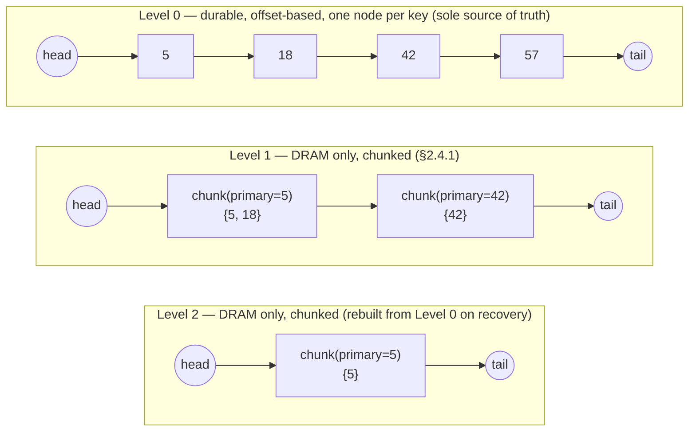
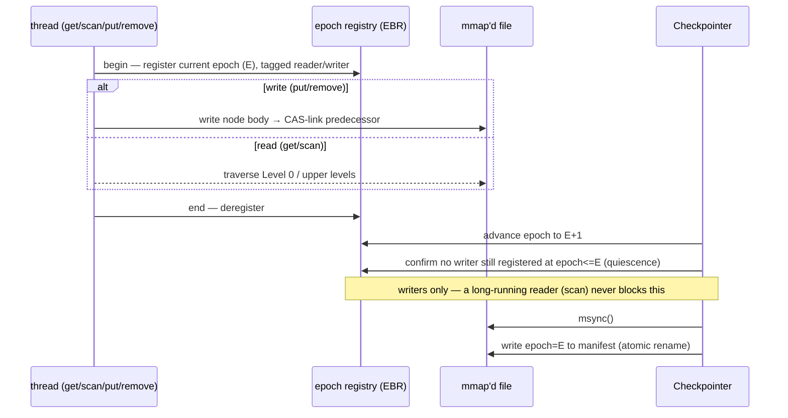
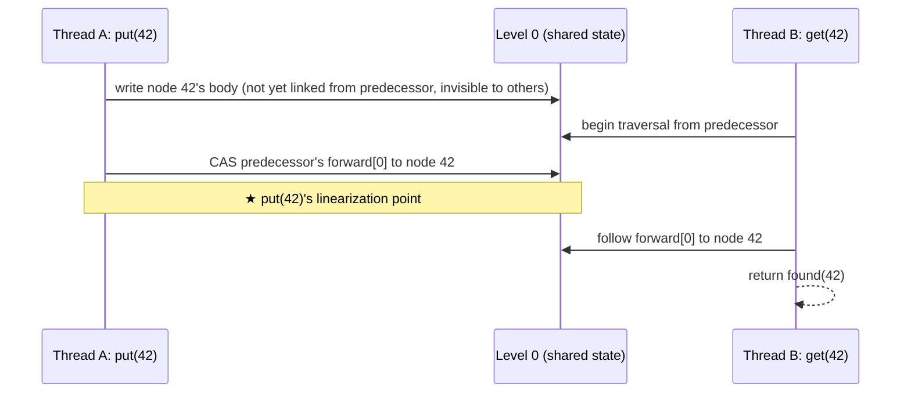

# pskiplist High Level Design

## 1. Overview

`pskiplist` is an offset-based, persistent skip list library that is simultaneously
**lock-free**, **crash-consistent** (via `mmap` + `msync`), and supports **real physical
reclaim** of removed nodes. It has no dependency on any specific key-value store.

Design provenance and references: §8.

## 2. Data Structures



### 2.1 Node (durable, Level 0 only)

```c++
struct DurableNode {
    std::atomic<uint64_t> epoch;                 // creation epoch (crash-safety), immutable
    Key key;
    std::atomic<NodeState> state;                // live / tombstoned-linked / tombstoned-unlinked
    std::atomic<NodeState> checkpointed_state;   // shadow of state (§4.1)
    std::atomic<uint64_t> version;               // seqlock guarding value: even=stable, odd=writing
    Value value;                                 // caller-supplied type, plain (non-atomic) field
    Value checkpointed_value;                    // shadow of value (§4.1)
    std::atomic<uint64_t> mutation_epoch;        // epoch of the most recent value/state change
    std::atomic<Offset> forward0;                // next node's offset + logical-delete mark bit
    std::atomic<Offset> next_checkpoint_unlink;  // pending-physical-unlink queue link (§2.3)
    std::atomic<bool> pending_checkpoint_unlink_queued;
};
```

- This is the only thing that lives in the mmap'd file — upper-level forward pointers are
  not part of it (§2.4), so every node is the same size regardless of how many levels it
  participates in.
- Nodes reference each other by **offset into the single mmap'd file**, not raw pointers, so
  the structure survives the mapped address changing across restarts.
- `Offset`'s top bit is reserved as the physical-unlink mark bit (§4.2); the remaining 63 bits
  are far more than enough node capacity in practice.
- **`Value` is a template parameter**: any trivially-copyable type of any size (`Key` has the
  same constraint). Since it can't be updated with a single CAS, `value` is a plain field
  protected by a seqlock (`version`) instead.
- **State** (live / tombstoned-linked / tombstoned-unlinked) is its own field, independent of
  `value`. `checkpointed_state` shadows it alongside `checkpointed_value` — see §4.1 for why
  both must be captured and reverted together.

### 2.2 Level 0 is the sole source of truth

- **Level 0** (the bottom singly-linked list, containing every live key) is the only durable
  structure; correctness after a crash is guaranteed here alone.
- **Upper levels** exist purely to accelerate search. They need not be durable and are rebuilt
  from Level 0 on every recovery.

### 2.3 Physical reclaim (two-phase) and the free list

Every node is fixed-size, so the free list is a simple mark-and-sweep over evenly-spaced
slots. It is not persisted — how it gets repopulated differs between startup and steady state.

Physical reclaim waits on two independent conditions:

1. **checkpoint() completion**: `remove()` only CASes the tombstone state (§4.1); physical
   unlink is deferred to checkpoint(), since reusing the slot before the removal is durable
   would destroy data a crash-then-recover might still need.
2. **EBR quiescence**: a just-unlinked node isn't freed until every reader registered at
   unlink time has deregistered (§3) — independent of (1), for concurrency safety.

- **At startup**: derived as a byproduct of the recovery walk (§2.2) — reachable offsets are
  live, everything else in the allocated range is free. Any tombstoned-linked node left over
  from an incomplete checkpoint is physically unlinked here too.

Neither queue is persisted — a crash just costs some reclaim opportunity, since the next
startup's recovery walk rediscovers everything independently.

### 2.4 Upper levels (volatile)

Each level (1 and above) is an independent lock-free list; the skip list as a whole is the
union of these lists.

- Pure DRAM, never present in the mmap'd file; rebuilt from Level 0 on every restart (§2.2).
- Ordinary pointers, not offsets — ASLR/offset-encoding concerns are Level-0-only.

#### 2.4.1 Chunking: multiple keys per node

Each upper-level node (`UpperChunk`) holds up to 32 keys from the same region of key space,
instead of exactly one. A classic one-key-per-node design forces one pointer-chase per hop per
search; clustering many keys per node cuts that count down.

```c++
struct UpperChunk {
    static constexpr int kCapacity = 32;
    struct Entry {
        Key key;
        Offset durable_offset;
        std::atomic<bool> published;  // separates slot claim from visibility
        std::atomic<bool> live;       // per-entry removal flag
    };
    Key primary_key;                  // this chunk's fixed position in the outer list
    Offset primary_offset;
    std::atomic<int> claimed;         // next entry slot to hand out
    std::atomic<int> live_count;      // live entries; the chunk unlinks once this hits 0
    Entry entries[kCapacity];
    std::atomic<uint64_t> forwards[/* height */];
};
```

- `primary_key`/`primary_offset` are fixed at creation for the chunk's whole lifetime — a
  routing coordinate, independent of whether that specific key is later removed.
- A new key is packed into its territory's chunk via a lock-free slot claim on `claimed`
  (**fast path**) — no linked-list mutation at all.
- Once a chunk is full, the next key in its territory gets its own new chunk, spliced in with
  the same CAS-based per-level insertion a fresh chunk always uses (**slow path**). This
  implicitly subdivides the full chunk's territory going forward. **No splits or merges** —
  existing entries are never moved or rebalanced.
- Removal CASes the entry's `live` to false; once `live_count` hits 0, the whole chunk is
  unlinked from every level via mark-and-help-splice (§4.2) and returned to the arena.
- Search finds the chunk with the largest `primary_key` below the target, then linearly scans
  its entries for the tightest usable hint. Chunk liveness during traversal is inferred solely
  from the forward-word mark bit — there is no separate liveness check.

#### 2.4.2 Arena allocation

`UpperChunk`s are bump-allocated from growable blocks (`UpperArena`), not individual `new`.

- Each block hands out slots via an atomic bump offset. A full block is retired and a new one
  installed.
- A block's buffer is only actually freed once every node it holds has been reclaimed *and*
  the block is retired *and* `reclaim()`'s EBR quiescence check (§3) confirms no writer could
  still hold a stale reference to it.

## 3. Epoch Design (unified EBR)



One global `epoch` counter serves **both** concurrency-safety (EBR) and crash-safety
(checkpoint boundaries). Every get/scan/put/remove registers the current epoch under a
reader/writer tag for its duration.

- **Crash-safety**: a new node's epoch stamp is the counter's value at creation.
  checkpoint()'s quiescence check waits for **writers only** — a predecessor CAS racing
  msync() could durable-ize a reachable-but-incomplete node, but a reader never mutates
  anything msync() could tear.
- **Concurrency-safety**: a just-unlinked node waits for registered readers to drain,
  independent of crash-safety.

Physical reclaim requires both of the above (§2.3).

`epoch` itself is not persisted; on restart it resumes from `manifest.epoch + 1` (never 0) to
stay monotonic across restarts.

**Recovery**: read manifest epoch `E`; any node whose creation epoch is `> E` is discarded
outright, and any node whose `mutation_epoch` is `> E` has its latest value/state reverted to
its checkpoint-time shadow.

**Manifest**: a 32-byte fixed header (magic, format version, `epoch`, `high_water_mark`,
FNV-1a64 checksum), written to `<path>.manifest` via temp file → fsync → atomic rename. Data
lives at `path` itself, `MAP_SHARED`, mutated in place (never rewritten on checkpoint). A
format-version mismatch is treated the same as no manifest at all.

## 4. Linearizability

Each level is an independent lock-free list; every operation's observable effect reduces to a
handful of atomic steps (listed below). Physical unlink after deletion is handled separately
(§4.2) — it doesn't move the linearization point, but needs its own memory-safety argument for
concurrent unlinks of adjacent nodes.



Linearization points:

- **put (new key)**: the CAS linking the predecessor's `forward[0]` to the new node.
- **put (existing key)**: the release store (`version += 2`) that ends the seqlock write of
  the new value (§4.1).
- **remove**: the CAS moving `state` from `live` to `tombstoned-linked`. Physical unlink is a
  later, separate event that doesn't move this point, but must still complete correctly for
  reclaim (§2.3) to be safe — see §4.2.
- **get/scan**: the point at which the relevant Level 0 range has been read.

In the diagram, Thread B's traversal reaches the predecessor *after* the link, so it finds 42;
reaching it before would correctly report "not found" — either outcome is consistent with
some real execution order.

### 4.1 State transitions and value read/write

State (§2.1's `state`) and value are separate fields with separate arbitration.

**State transitions** are single CASes on `state`:

- **remove**: `live` → `tombstoned-linked`.
- **resurrect** (put() targeting an existing tombstoned-linked node): `tombstoned-linked` →
  `live`.
- **physical unlink, step one**: `tombstoned-linked` → `tombstoned-unlinked`. The
  predecessor's real pointer is updated in a later step (§4.2); `find()`/`get()`/`scan()` all
  decide based on the node's own state, so a stale predecessor pointer never affects
  correctness.

Resurrect and physical-unlink-step-one CAS the same field with different expected values, so
at most one can succeed — the loser either retries (`put()`, seeing the node is gone) or gives
up (unlink, seeing it was resurrected first). No separate reachability check is needed.

**Value read/write** goes through a **seqlock** (`version`), since an arbitrary-size `Value`
can't be updated by a single CAS:

- **Writer** (put()'s value update, or remove()'s shadow-only call): CAS `version` even→odd to
  claim exclusivity, (shadow capture, below), write `value` as a plain field, release-store
  `version + 2`.
- **Reader** (get/scan): load `version` (acquire); if odd, yield and retry. If even, read
  `value` as a plain field, fence (acquire), then re-check `version` unchanged — otherwise
  retry (the classic seqlock read-retry pattern).

**Reverting across a checkpoint boundary**: right after claiming exclusivity, if
`mutation_epoch` is still at or before the last checkpoint's epoch (first touch since that
checkpoint), the writer shadows the current `value`/`state` into `checkpointed_value`/
`checkpointed_state` before mutating. `recover()` reverts both fields together whenever
`mutation_epoch` exceeds the manifest epoch. Both must revert together: reverting only `value`
after a crash mid-resurrect (delete → checkpoint → resurrect) would leave `state` stuck at
`tombstoned-linked`, and recovery's own cleanup pass (§7) would then wrongly unlink a value it
had just correctly restored.

### 4.2 Physical unlink helping

Physical unlink's first step (§4.1) isn't triggered directly by `remove()` — it runs in a
batch once checkpoint() has committed the manifest (§2.3), consistent with treating deletion
like any other checkpoint-boundary change. From there, it completes as lock-free helping
inside the search path (`find`) shared by get/put/remove/scan — no dedicated lock.

- Right after the state CAS, the target node's own `forward0` is CASed to set the mark bit
  while preserving the current successor (retried if a concurrent insert changed it).
- Marking the node's *own* word (not the predecessor's) freezes it: any subsequent
  unmark-expecting CAS on it fails.
- `find` helps splice out any marked node it encounters, CASing the predecessor's word from
  "→ marked node" to "→ marked node's successor". Only the CAS's winner enqueues the node for
  reclaim (§2.3) — the CAS outcome alone decides who does it, so concurrent helpers never
  double-enqueue.
- `remove()` may also try the same splice once itself; if it loses, some later `find` passing
  through will complete it.
- The mark bit ensures adjacent concurrent unlinks, or an insert racing a physical unlink,
  always resolve via one side's CAS failing and retrying from fresh state — a spliced-out node
  can never be relinked via a stale successor value.

## 5. API

```c++
class PSkipList {
 public:
  explicit PSkipList(const std::filesystem::path &path, size_t capacity_bytes);

  // Does not implicitly checkpoint() on destruction -- durability of anything since the last
  // checkpoint() is unspecified without one (§3). Assumes no concurrent access during destruction.
  ~PSkipList();

  // O(log N) expected. Not-found if the matched node's state (§4.1) isn't live.
  auto get(const Key &key) const -> std::optional<Value>;

  // O(log N) expected. Returns false only if capacity (§2.6) is exhausted.
  [[nodiscard]] auto put(const Key &key, const Value &value) -> bool;

  // O(log N) expected. Physical unlink (§4.1/4.2) is deferred to checkpoint() (§2.3).
  // Returns false if the key didn't exist.
  [[nodiscard]] auto remove(const Key &key) -> bool;

  // O(log N + k). Skips any node whose state isn't live.
  void scan(const Key &begin, const Key &end, std::function<void(const Key &, const Value &)> callback) const;

  // Synchronous, blocking. Concurrent callers serialize on a mutex. Guarantee: any put()/
  // remove() that had already returned before this call started is durable if it returns true.
  [[nodiscard]] auto checkpoint() -> bool;

  // Called from the constructor: reads the manifest epoch, walks Level 0, and rebuilds the
  // upper levels and free list.
};
```

## 6. Testing Strategy

Crash-consistency and concurrency-safety are verified separately — covering both together
(including concurrent writes racing msync()) would be combinatorially expensive.

- **Concurrency-safety**: verify EBR quiescence (§3) actually blocks until every operation
  registered at epoch E deregisters, under deliberately adversarial scheduling. Includes
  concurrent removal of adjacent nodes and helping on marked nodes (§4.2). ThreadSanitizer,
  plus a lightweight linearizability check where practical.
- **Crash-consistency**: given quiescence, the instant of msync() is a clean, non-concurrent
  snapshot. Inject a crash immediately after each atomic step (node writes, Level 0 CAS,
  state-transition CASes, §4.1) and verify `recover()` restores its invariants (the RECIPE
  paper's technique: decomposing operations into few atomic steps keeps the search space linear).

## 7. Open Issues

- **Physical-reclaim timing**: close to nbMontage's anti-node approach, but adapting it to a
  single offset-based mmap'd file needed its own verification — implementation plus crash-
  injection and concurrency tests were the first milestone.
- **Upper-level recovery cost**: Level 0's authority (§2.2) avoids torn writes, but rebuilding
  the upper levels on recovery is O(corpus).
- **Cache locality**: chunking and arena allocation (§2.4) improved both per-hop cost and
  total hop count versus a plain one-key-per-node design, but a pointer-chasing hop is still a
  dependent, unpredictable memory access — slower than a flat array's computable index
  arithmetic. Level 0 itself is laid out in insertion order, not key order, so `scan()`'s
  sequential key-order walk can bottleneck on this. Not yet addressed.
- **Concurrent checkpoint() calls**: currently serialized via `std::mutex` (§5). nbMontage
  instead coalesces concurrent `sync()` calls into one cooperative operation that pushes a
  shared epoch counter to its target (at the cost of a 2-epoch retention buffer) — noted here
  as an option if this ever becomes a real bottleneck.
- **recover()'s unlink cleanup pass is unverified by dedicated test**: `remove()` defers
  physical unlink to checkpoint() (§2.3) so a slot is never reused before its removal is
  durable. `recover()` accordingly has a cleanup pass for any node left tombstoned-linked by a
  crash between checkpoint()'s manifest write and its unlink drain — without it, that slot
  would be lost permanently (though get()/scan() correctness is unaffected either way). A
  dedicated crash-injection test for this exact window was skipped: reproducing it needs
  direct mmap-byte manipulation for low payoff, and neither ASan/TSan/LeakSanitizer can detect
  a stuck free-list slot (it's neither a heap leak nor a data race).

## 8. Design Provenance

No new algorithm is proposed here — the design combines elements from existing work.

| Element | Source | Notes |
| --- | --- | --- |
| Concurrent algorithm base (each level as an independent lock-free list) | Herlihy & Shavit, *The Art of Multiprocessor Programming* | Mark-then-help-splice logical/physical deletion split, simplified to a 3-state field (§2.1/4.1). One generic implementation shared by Level 0 and upper levels, differing only in identity type (offset vs. pointer). |
| Offset-based node references | UPSkipList; LMDB-style mmap+offset | Survives the mapped virtual address changing across restarts. |
| Level 0 as sole authority, upper levels DRAM-only/rebuilt | ASCS; NV-Skiplist (independently) | Avoids torn writes across multi-level pointer updates by excluding upper levels from durability. |
| Insert write order (node body → own forward pointer → predecessor CAS, bottom-up) | ASCS | Log-free failure-atomic insertion. |
| Delete write order (upper levels top-down, then Level 0, then physical free) | ASCS | Durable side is a single Level 0 unlink (§2.1); ASCS's order applies to the volatile upper-level best-effort unlink. |
| Physical reclaim = structural SMR (concurrency) + epoch-gated auto-reclaim (crash-safety) | nbMontage's `pretire`/`pdetach` anti-node scheme | Direct precedent for §3; adapted here to a single offset-based mmap'd file. |
| Free list derived from a Level-0 recovery walk, never persisted | This library (extends ASCS/NV-Skiplist's "rebuild from Level 0" idea to the free list) | Avoids the free list's own records being a torn-write target. |
| Bump-pointer block arena for upper-level nodes (§2.4.2) | RocksDB's memtable `Arena` | Block-level freeing gated on EBR quiescence is this library's own extension. |
| Fixed capacity, generously sized sparse file (§2.6) | LMDB | Same no-runtime-growth constraint, in wide production use. |
| Why not RECIPE directly | RECIPE (Lee et al.) | Herlihy-style non-blocking, non-repairing writes don't satisfy any of RECIPE's three conditions (per UPSkipList's analysis). |

**References**

- Herlihy, M., Shavit, N. *The Art of Multiprocessor Programming.* Morgan Kaufmann, 2008.
- Xiao, R., et al. "Write-Optimized and Consistent Skiplists for Non-Volatile Memory." *IEEE
  Access* 9 (2021): 69850–69859. (ASCS)
- Chen, Q., Yeom, H. "Design of skiplist based key-value store on non-volatile memory." IEEE
  FASW 2018; extended in *Cluster Computing* 22, 2 (2019): 361–371. (NV-Skiplist)
- Chowdhury, S., Golab, W. "Brief Announcement: A Scalable Recoverable Skip List for
  Persistent Memory." SPAA 2021. (UPSkipList)
- Lee, S.K., et al. "RECIPE: Converting Concurrent DRAM Indexes to Persistent-Memory
  Indexes." SOSP 2019. <https://github.com/utsaslab/RECIPE>
- Cai, W., et al. "Fast Nonblocking Persistence for Concurrent Data Structures." DISC 2021.
  <https://github.com/urcs-sync/Montage> (nbMontage)
- Wang, X. "How LMDB Works." <https://xgwang.me/posts/how-lmdb-works/>; dbdb.io, "LMDB."
  <https://dbdb.io/db/lmdb>
- RocksDB `memory/arena.h` / `memtable/skiplist.h`.
  <https://github.com/facebook/rocksdb/blob/main/memory/arena.h>
